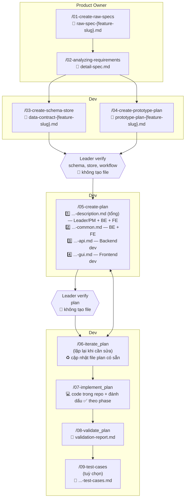
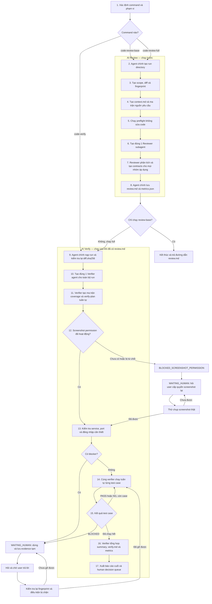

# 1. RPI cho Claude Code — Analyze → Schema/Store → Prototype → Plan → Implement → Validate → Test Cases

<details>
<summary>Mở workflow RPI</summary>

Bộ công cụ `.claude/` dùng để chuẩn hoá quy trình từ ý tưởng → yêu cầu → thiết kế dữ liệu/UI → plan →
code → kiểm tra. Mỗi lệnh (slash command) tương ứng 1 file trong `.claude/commands/`, các bước nối
tiếp nhau qua file trung gian lưu trong `thoughts/`.

**Tên file được đánh số theo đúng thứ tự chạy** (`01-...` → `09-...`), số thứ tự cũng chính là tên
lệnh gọi (ví dụ file `05-create-plan.md` → gõ `/05-create-plan`).

> Đây là bản chuyển từ `.cursor/` (Cursor) sang cấu trúc chuẩn của Claude Code. Rule "always apply"
> của Cursor (`global.mdc`) đã được chuyển thành [`CLAUDE.md`](../CLAUDE.md) ở gốc repo (Claude Code
> tự nạp file này).

## Hướng dẫn dùng từng lệnh

| # | Lệnh | Vai trò | Khi nào dùng | Input | Output — file được tạo ra |
| - | --- | --- | --- | --- | --- |
| 1 | `/01-create-raw-specs` | **Product Owner** | Có một **ý tưởng feature ngắn**, chưa rõ ràng, cần cấu trúc lại thành spec thô ban đầu trước khi phân tích sâu. | Ý tưởng feature (1 câu đến vài đoạn). | **1 file:** `<thư-mục do user chọn>/raw-spec-{feature-slug}.md` — spec thô, có mục "Open Questions" cho phần chưa rõ. |
| 2 | `/02-analyzing-requirements` | **Product Owner** | Yêu cầu còn **mơ hồ**, cần điều tra codebase + hỏi làm rõ trước khi ai đó implement. Chạy mode BA. | Raw spec / ticket / mô tả yêu cầu (có thể lấy từ bước 1 hoặc yêu cầu trực tiếp từ PM). | **1 file:** `<thư-mục do user chọn>/detail-spec.md` (tên file cố định, chỉ thư mục do user chọn) — tài liệu phân tích đã chốt với user, làm nguồn sự thật cho các bước sau. |
| 3 | `/03-create-schema-store` | **Dev** | Cần **thống nhất DB schema và GUI store** thành một hợp đồng dữ liệu (data contract) duy nhất — **bắt buộc làm trước khi lập plan** nếu feature có dữ liệu mới/thay đổi dữ liệu. | `detail-spec.md` (hoặc raw spec đã chốt) + khảo sát schema/store hiện có trong code. | **1 file:** `<thư-mục do user chọn>/data-contract-{feature-slug}.md` — gồm ERD, migration outline, repository layer, thiết kế GUI store, và bảng mapping DB ↔ API ↔ GUI store. |
| 4 | `/04-create-prototype-plan` | **Dev** | Cần **chuyển design (Figma/mockup) thành component** để duyệt UI/UX trước khi code thật. Track riêng của GUI, không đụng dữ liệu. | Design nguồn (link Figma/ảnh) + `detail-spec.md`. | **1 file:** `<thư-mục do user chọn>/prototype-plan-{feature-slug}.md` — bảng map design → component/token, danh sách màn hình, flow, các bước dựng prototype. |
| — | *Leader verify: schema, store, workflow* | **Leader** | **Checkpoint bắt buộc** trước khi qua bước 5 — Leader review `data-contract-{feature-slug}.md` (bước 3) và `prototype-plan-{feature-slug}.md` (bước 4): schema/store có nhất quán, workflow/luồng dữ liệu có hợp lý không. | `data-contract-{feature-slug}.md` + `prototype-plan-{feature-slug}.md` | **Không tạo file mới** — chỉ là quyết định duyệt (đi tiếp bước 5) hoặc trả lại bước 3/4 để sửa. |
| 5 | `/05-create-plan` | **Dev** | Đã có đủ: requirement đã chốt (bước 2), và nếu cần: data contract (bước 3), prototype plan (bước 4), và đã qua checkpoint Leader verify schema/store/workflow. Giờ lập **plan implementation chi tiết**, có diagram luồng xử lý. | `detail-spec.md` + `prototype-plan-{feature-slug}.md` + `data-contract-{feature-slug}.md` | **Tối đa 4 file** trong `<plan-dir>` do user chọn (xem [`05-create-plan.md`](commands/05-create-plan.md)):<br>**1.** `<plan-dir>/YYYY-MM-DD-ENG-XXXX-description.md` — **plan tổng** (luôn tạo) — nơi **duy nhất** chứa bối cảnh, quyết định thiết kế, sơ đồ luồng và **ma trận công việc** (mỗi hạng mục → 1 scope → 1 phase → 1 sub-plan); dành cho **Leader/PM** duyệt tổng thể và cho **cả BE lẫn FE dev**<br>**2.** `<plan-dir>/YYYY-MM-DD-ENG-XXXX-description-common.md` — **plan common** (nếu có phần dùng chung API/GUI) — dành cho **cả BE lẫn FE dev** (schema, contract, quy ước dùng chung)<br>**3.** `<plan-dir>/YYYY-MM-DD-ENG-XXXX-description-api.md` — **plan API** (nếu có phần backend) — dành riêng cho **Backend dev**<br>**4.** `<plan-dir>/YYYY-MM-DD-ENG-XXXX-description-gui.md` — **plan GUI** (nếu có phần frontend) — dành riêng cho **Frontend dev**<br>Sub-plan **không lặp lại** bối cảnh của plan tổng — chỉ chứa phần lệch + các phase thi công. |
| — | *Leader verify: plan* | **Leader** | **Checkpoint bắt buộc** trước khi qua bước 6 — Leader review plan tổng + các sub-plan (bước 5): ma trận công việc có phủ hết phạm vi, phân chia common/API/GUI, thứ tự phase và tiêu chí verify có đúng hướng không. | Bộ file plan từ bước 5 | **Không tạo file mới** — chỉ là quyết định duyệt (đi tiếp bước 6+) hoặc trả lại bước 5/6 (`iterate_plan`) để sửa. |
| 6 | `/06-iterate_plan` | **Dev** | Plan đã tạo nhưng cần **sửa** theo feedback (thêm phase, đổi phạm vi...) — không tạo lại từ đầu. | Đường dẫn (các) file plan cần sửa + nội dung feedback. | **0 file mới** — cập nhật tại chỗ (các) file plan đã có (tổng và/hoặc sub-plan liên quan). |
| 7 | `/07-implement_plan` | **Dev** | Plan đã **được duyệt**, bắt đầu **viết code** theo từng phase. | Đường dẫn (các) file plan (đã duyệt). | **0 file tài liệu mới** — code thay đổi trong repo + heading phase trong sub-plan được đánh dấu ✅ dần theo tiến độ. |
| 8 | `/08-validate_plan` | **Dev** | Đã implement xong (toàn bộ hoặc 1 phase), cần **đối chiếu code thực tế với plan** để biết pass/fail — không tự sửa code. | Đường dẫn (các) file plan đã implement. | **1 file:** `<cùng thư mục với plan>/validation-report.md` — báo cáo pass/fail theo từng tiêu chí, đề xuất fix chờ duyệt (ghi đè nếu đã tồn tại). |
| 9 | `/09-test-cases` | **Dev** | Cần bộ **test case chi tiết** để QA/dev verify (khuyến nghị cho feature phức tạp). Có thể chạy sau bước 2, 5 hoặc 8. | `plan.md` / `detail-spec.md` / ticket / requirement thuần. | **1 file:** `thoughts/shared/test-cases/YYYY-MM-DD-ENG-XXXX-description-test-cases.md` — chia rõ Automated vs Manual, bám theo phạm vi của plan. |

## Luồng khuyến nghị



**Kết quả của từng bước:**

| Bước | File tạo ra |
| --- | --- |
| 1. `/01-create-raw-specs` | `raw-spec-{feature-slug}.md` |
| 2. `/02-analyzing-requirements` | `detail-spec.md` |
| 3. `/03-create-schema-store` | `data-contract-{feature-slug}.md` |
| 4. `/04-create-prototype-plan` | `prototype-plan-{feature-slug}.md` |
| Leader verify schema/store/workflow | *(không tạo file)* |
| 5. `/05-create-plan` | **1.** `...-description.md` (tổng) — Leader/PM + BE + FE **2.** `...-common.md` — BE + FE **3.** `...-api.md` — Backend dev **4.** `...-gui.md` — Frontend dev |
| Leader verify plan | *(không tạo file)* |
| 6. `/06-iterate_plan` | *(không tạo file mới, cập nhật plan có sẵn)* |
| 7. `/07-implement_plan` | *(không tạo file tài liệu mới, chỉ code + đánh dấu ✅ theo phase)* |
| 8. `/08-validate_plan` | `validation-report.md` |
| 9. `/09-test-cases` | `YYYY-MM-DD-ENG-XXXX-description-test-cases.md` |

- Bước 1, 2 do **Product Owner** phụ trách — chốt ý tưởng thành requirement rõ ràng.
- Bước 3, 4 do **Dev** phụ trách, **chạy song song được**, cả hai chốt xong mới qua checkpoint Leader verify.
- **Leader verify schema/store/workflow** là checkpoint bắt buộc trước khi qua bước 5 — không skip.
- Bước 5 do **Dev** phụ trách (lập plan).
- **Leader verify plan** là checkpoint bắt buộc trước khi qua bước 6 — không skip.
- Bước 6–9 do **Dev** phụ trách; bước 5 ⇄ 6 lặp lại đến khi plan không còn câu hỏi mở.
- Bước 9 tuỳ chọn, có thể chạy ở nhiều mốc: sau bước 2, 5 hoặc 8.

**Vì sao bước 3 và 4 đứng trước bước 5:** `/05-create-plan` yêu cầu không được đoán mò — nếu chưa
chốt schema DB, GUI store, và màn hình/component, plan sẽ phải tự giả định dữ liệu và UI, dễ sai lệch
khi implement. Bước 3 lo tầng **dữ liệu** (backend schema + client store phải khớp nhau), bước 4 lo
tầng **trình bày** (design → component, không đụng dữ liệu) — tách biệt để mỗi bước gọn và tái dùng
được cho project khác.

**Vì sao có 2 checkpoint Leader verify:** mỗi checkpoint chặn một loại sai lệch khác nhau. Checkpoint
sau bước 3/4 chặn sai lệch ở tầng **dữ liệu/thiết kế** (schema, store, workflow) trước khi nó lan sang
plan. Checkpoint sau bước 5 chặn sai lệch ở tầng **phạm vi/kế hoạch triển khai** trước khi Dev bắt tay
viết code — sửa plan luôn rẻ hơn sửa code đã viết.

## Mẫu file kết quả (`.claude/commands/assets/`)

Command chỉ chứa **quy trình**; hình dạng file kết quả nằm trong `assets/`. Template dùng **heading
tiếng Anh, nội dung tiếng Việt** — sửa template là đổi được format đầu ra mà không đụng vào command:

| File mẫu | Lệnh sử dụng | File được tạo |
| --- | --- | --- |
| `raw-spec-template.md` | `/01-create-raw-specs` | `raw-spec-{feature-slug}.md` |
| `detail-spec-template.md` | `/02-analyzing-requirements` | `detail-spec.md` |
| `plan-master-template.md` | `/05-create-plan` | `...-description.md` (plan tổng) |
| `plan-subplan-template.md` | `/05-create-plan` | `...-common.md` · `...-api.md` · `...-gui.md` |
| `validation-report-template.md` | `/08-validate_plan` | `validation-report.md` |
| `test-cases-template.md` | `/09-test-cases` | `...-test-cases.md` |

## File tham chiếu của dự án (`.claude/commands/references/`)

Các command chỉ chứa **quy tắc chung**. Thông tin riêng của dự án như công nghệ, cách đặt tên và cấu
trúc thư mục nằm trong các file tham chiếu. Khi dùng bộ command cho dự án khác, cần thay các file này.

| File tham chiếu | Lệnh sử dụng | Nội dung |
| --- | --- | --- |
| `ba-checklist.md` | `/01-create-raw-specs` | Checklist 10 mục BA dùng để soi ý tưởng và tìm gap. |
| `db-schema-conventions.md` | `/03-create-schema-store` | DB engine, ORM, migration tool, naming, repository layer (đã điền cho seconder.ai: MongoDB + Mongoose). |
| `gui-store-conventions.md` | `/03-create-schema-store` | Thư viện state phía client, cách tách server-state/client-state (đã điền cho seconder.ai: `fast-context` + `secFetch`, không dùng Redux/Zustand). |
| `uiux-design-conventions.md` | `/04-create-prototype-plan` | UI framework, design token, component library có sẵn (đã điền cho seconder.ai: Tailwind v4 + shadcn/radix). |
| `testing-principles.md` | `/09-test-cases` | Nguyên tắc và pattern viết test. |
| `subagent-research.md` | `/05-create-plan`, `/06-iterate_plan` | Cách spawn và kiểm chứng sub-agent research: khi nào cần, prompt gồm gì, agent nào cho việc gì. |

## Các agent hỗ trợ (`.claude/agents/`)

Mỗi agent xử lý một nhiệm vụ riêng. Các agent có thể chạy song song khi an toàn, nhưng workflow
review luôn phải chạy `reviewer` xong trước rồi mới chạy `verifier`.

| Agent | Vai trò |
| --- | --- |
| `business-analyst` | Làm rõ yêu cầu → tài liệu phân tích đã chốt (`detail-spec.md`) |
| `codebase-locator` | Tìm file/module nằm Ở ĐÂU |
| `codebase-analyzer` | Giải thích code hoạt động THẾ NÀO (`file:line`) |
| `codebase-pattern-finder` | Tìm ví dụ/pattern có sẵn để làm theo |
| `thoughts-locator` | Tìm tài liệu nằm ở đâu trong `thoughts/` |
| `thoughts-analyzer` | Rút insight quan trọng từ tài liệu đã có |
| `web-search-researcher` | Tra cứu thông tin bên ngoài/mới nhất |
| `reviewer` | Review toàn bộ GUI, backend/API, package dùng chung và hạ tầng; tạo finding và yêu cầu kiểm chứng |
| `verifier` | Kiểm chứng độc lập bằng package test, API, CLI hoặc Playwright CLI khi cần trình duyệt |

Phần lớn các agent nghiên cứu chỉ **đọc** (mô tả hiện trạng, không phê bình). `business-analyst` chỉ
được ghi file phân tích sau khi user đã xác nhận với agent chính.

## Các skill (`.claude/skills/`)

Skill là hướng dẫn dùng lại mà agent tự đọc khi phù hợp; skill không phải slash command.

- `research-codebase` — nghiên cứu codebase song song → `thoughts/shared/research/`
- `refactor` — chuẩn code bắt buộc (KISS/DRY/YAGNI/SOLID/Clean Code + performance + error handling) cho cả plan lẫn implement
- `code-review-gui` / `reactjs-code-review` / `solidjs-code-review` — chuẩn review cho frontend
- `code-review` — review tĩnh cho `/code-review-base`; review đầy đủ backend và không chạy service/Chrome
- `code-verify` — kiểm chứng `review.md` bằng package test, API, CLI hoặc Chrome khi thật sự cần trình duyệt

## Nguyên tắc xuyên suốt các bước

- **Analyze** làm rõ ý định (đã có research codebase tích hợp sẵn) — không bao giờ code.
  **Schema/Store, Prototype** chốt data contract và thiết kế UI — không code, không viết plan.
  **Plan/Iterate** lên kế hoạch — không code. **Implement** viết code — nhưng tin tưởng plan, không
  research lại phần đã có tài liệu. **Validate** đối chiếu code với plan — không tự bịa tiêu chí,
  không tự sửa code. **Test cases** đặc tả cách verify hành vi — không implement.
- Phạm vi và nguyên tắc YAGNI nằm trong **plan** (mục "Những gì KHÔNG làm"); validate và test-cases
  tôn trọng phạm vi đó, không tự thêm coverage ngoài phạm vi.
- Mọi khẳng định/thay đổi hành vi đều kèm tham chiếu `file:line`.
- Tiêu chí hoàn thành luôn tách **Automated vs Manual**; plan cuối cùng phải **không còn câu hỏi mở**.
  Test-cases áp dụng cách tách tương tự; validate report chấm pass/fail theo đúng các tiêu chí đó.
- Tài liệu analysis, data contract, prototype plan, plan, validation report, test-cases đều viết bằng
  **tiếng Việt** (đường dẫn, định danh, code giữ nguyên tiếng Anh).

</details>

# 2. AI Review và AI Verify

<details>
<summary>Mở workflow AI Review và AI Verify</summary>

Workflow này có hai AI độc lập:

- **AI Reviewer** đọc code và tìm rủi ro. AI này không mở service, không đăng nhập và không dùng
  Chrome.
- **AI Verify** kiểm chứng từng nhận định bằng test, API, CLI hoặc Playwright CLI. Browser được dùng cho
  hành vi phụ thuộc trình duyệt hoặc để verify API độc lập qua Swagger trước khi GUI tích hợp.

Mỗi skill có quy tắc và template riêng. `code-review` tạo file 01–07; `code-verify` nhận đúng thư mục
đó rồi tạo file 08–11, không cần thư mục trung gian.

## Sơ đồ hoạt động



### Ghi chú từng bước

1. **Xác định command và phạm vi:** Agent chính đọc tham số như `staged`, branch gốc, PR, file hoặc
   thư mục. `/code-review-base` chỉ chạy nhánh Review; `/code-verify` bắt đầu từ run đã có;
   `/code-review-full` chạy tuần tự cả hai nhánh.
2. **Tạo run directory:** Agent chính tạo `test-features/<feature-slug>/<run-id>/`. Đây là thư mục
   duy nhất chứa artifact của lần chạy.
3. **Đóng băng đầu vào:** Luôn tạo `diff.patch` và `diff.sha256`; `scope.txt` riêng chỉ tạo với
   `--debug`. Reviewer và Verifier phải dùng cùng bản diff này.
4. **Tạo context:** Agent chính ưu tiên spec và plan đã duyệt; sau đó tổng hợp workflow/wiki,
   business logic cũ và mới, hành vi user, logic hệ thống hiện tại, chức năng liên quan, API
   contract, schema, performance, security, xử lý lỗi, rules và format vào `context.md`. Nếu nguồn
   mâu thuẫn, ghi `CONTEXT_GAP` thay vì tự chọn đáp án.
5. **Chạy preflight:** Chạy typecheck, lint không `--fix`, test tĩnh và công cụ có sẵn. Không sửa
   source, update snapshot, migrate, deploy hoặc publish.
6. **Tạo Reviewer subagent:** Agent chính tạo **đúng một** subagent dùng role `reviewer`. Không tách
   Reviewer theo FE/BE vì một agent cần nhìn được toàn bộ luồng end-to-end.
7. **Reviewer phân tích:** Reviewer đọc diff, context, preflight, code/wiki liên quan và toàn bộ
   `refactor` skill; tìm reachable execution path, đánh giá impact/confidence. Reviewer tạo contract
   cho mọi requirement/invariant áp dụng được, không chỉ cho finding. Reviewer không chạy Chrome
   hoặc service.
8. **Lưu kết quả review:** Agent chính kiểm tra format rồi ghi `review.md` và khởi tạo `metrics.json`.
   `/code-review-base` dừng tại đây.
9. **Kiểm tra handoff:** Khi bắt đầu Verify, agent chính nạp đúng run và tính lại fingerprint. Nếu
   khác `diff.sha256`, trả `STALE_REVIEW` và không verify code đã thay đổi.
10. **Tạo một Verifier agent:** Agent chính tạo đúng một subagent dùng role `verifier` cho toàn bộ
    verify run. Verifier không được tạo coordinator, worker hoặc verifier subagent khác.
11. **Lập kế hoạch verify:** Verifier lập ma trận coverage theo cùng nhóm nguồn, rồi chuyển từng
    requirement/invariant và contract áp dụng được thành test case có ID ổn định; ghi trích dẫn
    nguồn, logic cũ/mới, chức năng bị ảnh hưởng, method, service, auth, dependency, evidence và thứ
    tự chạy tuần tự.
12. **Kiểm tra quyền screenshot:** Trước test case đầu tiên, phải chụp thử thành công. Nếu chưa có
    quyền hoặc user từ chối, chuyển `BLOCKED_SCREENSHOT_PERMISSION`, hỏi user cấp quyền lại và đứng
    yên tại bước này. Không được skip, đổi phương pháp để né quyền hoặc chạy sang bước tiếp theo.
    Lần chụp này bắt buộc chạy bằng `playwright-cli`; không dùng Chrome Agent hoặc Chrome MCP.
13. **Mở điều kiện chạy:** Sau khi screenshot hoạt động, kiểm tra port/service theo `CLAUDE.md`; dùng
    lại service đang chạy và thiết lập API login hoặc Chrome session khi cần.
14. **Chạy tuần tự test case:** Cùng một Verifier dùng package test, API, CLI, static trace, Chrome
    Playwright CLI hoặc `swagger-playwright`, xử lý từng case theo thứ tự. GUI/Swagger phải screenshot sau mỗi
    assertion quan trọng. Swagger API-only phải ghi `API_ONLY`.
15. **Xử lý kết quả:** Verifier ghi Expected, Actual, `PASS | NG | BLOCKED` và evidence cho case hiện
    tại. `PASS`/`NG` đi tới case kế tiếp; `BLOCKED` dừng workflow và chuyển `WAITING_HUMAN`.
16. **Tổng hợp:** Sau khi chạy hết, chính Verifier ghi `summary.md`, `verify.md`, cập nhật
    `metrics.json` và tạo human decision queue. `summary.json` chỉ được tạo với `--debug`.
17. **Kết thúc:** Báo cáo liên kết từng finding với test case/evidence. Workflow không phát
    `APPROVED` hoặc `SAFE TO MERGE`; quyết định merge thuộc về con người.

## Vì sao cần hai AI

AI có thể sinh code nhanh và nhiều hơn khả năng con người đọc kỹ. Nếu chỉ dùng một AI vừa review vừa
tự kiểm chứng, AI dễ tin lại nhận định ban đầu của chính mình, bỏ sót luồng liên quan hoặc xem test
pass là bằng chứng code hoàn toàn đúng.

Workflow tách hai trách nhiệm để giảm rủi ro đó:

- **AI Reviewer** tìm vấn đề có thể xảy ra và chỉ rõ cần kiểm chứng điều gì.
- **AI Verify** không tin kết luận của Reviewer ngay. Nó dùng điều kiện độc lập để thử chứng minh hoặc
  bác bỏ từng nhận định và lưu bằng chứng.

Hai AI hỗ trợ con người thu hẹp phần cần đọc và đưa ra evidence dễ kiểm tra. Chúng không thay thế
developer, QA, security reviewer hoặc code owner.

## AI Reviewer hoạt động như thế nào

1. Chốt phạm vi thay đổi và tạo `diff.patch` cùng `diff.sha256`.
2. Ưu tiên spec và plan đã duyệt; tiếp theo đọc workflow/wiki, business logic cũ và mới, hành vi
   user, code hệ thống hiện tại, caller/dependency, chức năng liên quan, API contract và schema để
   tạo `context.md`.
3. Chạy typecheck, lint và test tĩnh phù hợp mà không sửa source.
4. Theo dõi luồng end-to-end thay vì chỉ đọc từng file riêng lẻ. Backend/API luôn là phạm vi review
   đầy đủ, không phụ thuộc Chrome.
5. Đánh giá rủi ro, tìm execution path có thể xảy ra và chỉ tạo finding khi có vị trí code, điều kiện
   kích hoạt, tác động và bằng chứng cụ thể.
6. Đọc `refactor` skill và dùng KISS, DRY, YAGNI, SOLID, Clean Code, performance và error handling
   làm checklist có bằng chứng; không tạo nhận xét style chung chung.
7. Tạo verification contract cho mọi nhóm áp dụng được: requirement, workflow, logic cũ/mới, hành
   vi user, regression/ảnh hưởng liên quan, performance, security, xử lý lỗi, rules và format; không
   chỉ tạo contract cho finding.
8. Ghi kết quả vào `review.md`; không chạy service, đăng nhập hoặc browser test.

## AI Reviewer đảm bảo điều gì

Reviewer đảm bảo về **quy trình review**, gồm:

- dùng đúng diff của checkout hiện tại, không dùng GitNexus;
- review cả frontend, backend/API, package dùng chung và hạ tầng bị ảnh hưởng;
- phân biệt spec, plan và code thực tế; không tự đoán khi thiếu context;
- finding phải có đường chạy hợp lý và bằng chứng có thể kiểm tra;
- nêu rõ phạm vi đã đọc, phần bị bỏ qua, context gap và blind spot;
- không sửa code và không đưa ra quyết định merge.

Reviewer **không đảm bảo** đã tìm thấy mọi bug, hiểu đúng mọi yêu cầu chưa được ghi rõ, dự đoán chính
xác production traffic/data hoặc xác nhận hành vi runtime chỉ bằng đọc code.

## AI Verify hoạt động như thế nào

1. Nhận đúng run directory và `review.md` do Reviewer tạo; kiểm tra lại `diff.sha256` để tránh verify
   nhầm phiên bản code.
2. Tạo ma trận nguồn và coverage, sau đó chuyển mọi requirement/invariant và verification contract
   áp dụng được thành test case có ID ổn định trong `verify-plan.md`; không tạo test chỉ dựa trên
   finding.
3. Chọn cách kiểm chứng nhỏ nhất nhưng đủ mạnh: package test, API, CLI, static trace hoặc Playwright CLI.
   Có thể dùng `swagger-playwright` để verify API độc lập khi GUI chưa tích hợp.
4. Kiểm tra service đã chạy chưa. Dùng lại service đúng; chỉ khởi động khi chưa có listener.
5. Thiết lập API/GUI login khi test case yêu cầu. GUI ưu tiên session từ Chrome của user và chỉ dùng
   các tab verify riêng.
6. Dùng đúng một Verifier agent và chạy tuần tự tất cả test case; không tạo verifier agent khác.
7. So sánh Expected và Actual, rồi ghi `PASS`, `NG` hoặc `BLOCKED` cùng screenshot/log/JSON đã che dữ
   liệu nhạy cảm.
8. Khi bị `BLOCKED`, dừng workflow, hỏi user và chỉ tiếp tục sau khi điều kiện bị chặn đã được kiểm
   tra lại thành công.

## AI Verify đảm bảo điều gì

Verifier đảm bảo về **khả năng truy vết kết quả**, gồm:

- không verify khi diff đã thay đổi;
- không chạy test case nào trước khi quyền screenshot được kiểm tra thành công;
- mỗi test case có Expected, Actual, kết luận và đường dẫn evidence;
- mỗi test case ghi nguồn tạo case, trích dẫn requirement/invariant, hành vi cũ/mới và chức năng liên
  quan khi áp dụng;
- GUI assertion có screenshot; API/CLI/test tĩnh có output đã che dữ liệu nhạy cảm;
- phân biệt rõ test fail (`NG`) với test chưa chạy được (`BLOCKED`);
- không coi test mirror theo implementation là bằng chứng độc lập;
- không tự bỏ qua auth, port conflict, dependency hoặc test gap;
- không khởi động trùng service, không kill process chiếm port và không thao tác browser data ngoài
  tab verify;
- báo rõ phần đã kiểm chứng, chưa kiểm chứng và giới hạn của evidence.

Verifier **không đảm bảo** test hiện có bao phủ toàn bộ hệ thống, môi trường local giống production,
fixture/test account phản ánh dữ liệu thật, screenshot chứng minh logic backend, hoặc một lần test
pass loại trừ race condition và lỗi không ổn định.

## Những điều workflow chưa làm được

- Không chứng minh code không còn bug hoặc an toàn tuyệt đối.
- Không thay thế human review, QA, security audit, performance/load test hoặc production monitoring.
- Không tự quyết định requirement khi spec, plan và code mâu thuẫn.
- Không tự tạo credential, fixture, dependency hoặc quyền truy cập còn thiếu.
- Không kiểm chứng được behavior cần hệ thống ngoài phạm vi nếu môi trường đó chưa sẵn sàng.
- Không chạy migration thật, deploy, publish, commit hoặc sửa source trong quá trình review/verify.
- Không tính precision/recall đáng tin cậy khi chưa có human disposition và bộ bug ground truth.
- Không đưa ra `APPROVED` hoặc `SAFE TO MERGE`; quyết định merge luôn thuộc về con người.

## Ba command

| Command | Khi nào dùng | Kết quả |
| --- | --- | --- |
| `/code-review-base` | Chỉ cần AI đọc và review code, chưa cần chạy ứng dụng | Tạo file **01–07** |
| `/code-verify` | Đã có `review.md` và cần kiểm chứng các nhận định | Tạo file **08–11** |
| `/code-review-full` | Muốn chạy đầy đủ từ review đến kiểm chứng | Chạy tuần tự hai command trên, tạo file **01–11** |

Có thể truyền `staged`, branch gốc, PR, file hoặc thư mục cần review:

```text
/code-review-base staged
/code-review-base staged --debug
/code-review-base apps/api/ai/src/modules/authentication
/code-verify test-features/<feature-slug>/<run-id>/
/code-verify test-features/<feature-slug>/<run-id>/ --debug
/code-review-full main
/code-review-full main --debug
```

## Thư mục và thứ tự file kết quả

Mỗi lần chạy lưu tại `test-features/<feature-slug>/<run-id>/`. Số thứ tự dưới đây thể hiện thứ tự
tạo và sử dụng file. Mặc định chỉ lưu nội dung human cần đọc lại và các file bắt buộc để handoff an
toàn. Thêm suffix `--debug` ở cuối command mới lưu toàn bộ file chẩn đoán.

| # | File hoặc thư mục | Mục đích | Command tạo |
| ---: | --- | --- | --- |
| 01 | `scope.txt` | Phạm vi review chi tiết | `/code-review-base --debug` |
| 02 | `diff.patch` | Bản chụp phần code thay đổi | `/code-review-base` |
| 03 | `diff.sha256` | Dấu vân tay để phát hiện code đã đổi trước khi verify | `/code-review-base` |
| 04 | `context.md` | Tổng hợp đặc tả, kế hoạch, kiến trúc, hợp đồng dữ liệu và phần còn thiếu | `/code-review-base` |
| 05 | `preflight.md` | Output preflight chi tiết; chế độ thường ghi bản tóm tắt trong `review.md` | `/code-review-base --debug` |
| 06 | `review.md` | Rủi ro, lỗi nghi ngờ và các yêu cầu cần kiểm chứng | `/code-review-base` |
| 07 | `metrics.json` | Số liệu của lần review và verify | `/code-review-base`, sau đó `/code-verify` cập nhật |
| 08 | `verify-plan.md` | Danh sách test case, phụ thuộc, đăng nhập, service và thứ tự chạy tuần tự | `/code-verify` |
| 09 | `test-cases/<case>/` | Luôn có `case.md` và evidence quyết định; `case.json`, raw log/network/console chỉ có với debug | `/code-verify`, đầy đủ với `--debug` |
| 10 | `test-cases/summary.md`, `summary.json` | Luôn có `summary.md`; `summary.json` chỉ có với debug | `/code-verify`, JSON với `--debug` |
| 11 | `verify.md` | Kết luận kiểm chứng cuối cùng | `/code-verify` |

Tên thư mục test case:

- `PASS-01-case-name/`: đã chạy và đúng yêu cầu.
- `NG-02-case-name/`: đã chạy nhưng kết quả sai yêu cầu.
- `BLOCKED-03-case-name/`: chưa thể chạy do đăng nhập, port, môi trường, dependency hoặc thiếu cách kiểm
  chứng.

`01`, `02`, `03` là số thứ tự test case trong `verify-plan.md`. Số này không đổi khi trạng thái đổi.
Một finding được xác nhận là bug sẽ có kết quả `CONFIRMED`, nhưng test case hành vi tương ứng vẫn là
`NG` vì hành vi thực tế không đúng yêu cầu.

## Quy tắc review

- Hoàn thành `context.md` trước khi review. Spec quy định sản phẩm phải làm gì; plan mô tả cách triển
  khai; diff cho biết code thực tế đã thay đổi gì. Plan không được thay đổi yêu cầu trong spec.
- Thứ tự nguồn là: spec → plan đã duyệt → workflow/wiki đã duyệt và invariant nghiệp vụ hiện có →
  diff/code hiện tại → quy ước runtime. Code/wiki được dùng để xác định logic cũ; logic mới phải có
  nguồn yêu cầu, không được suy ra chỉ từ implementation mới.
- Reviewer và Verifier phải cover: business logic cũ/mới, hành vi user, ảnh hưởng chức năng liên
  quan, performance, security, xử lý lỗi, rules và format. Mỗi nhóm phải là `COVERED`,
  `NOT_APPLICABLE`, `CONTEXT_GAP` hoặc `TEST_GAP`.
- Cả hai phải đọc `skills/refactor/SKILL.md`. Reviewer dùng nó để tìm vấn đề có bằng chứng; Verifier
  chỉ kiểm chứng invariant quan sát được, không tạo runtime test cho sở thích style và không sửa code.
- Nếu phạm vi vượt 40 file code, 2.000 dòng thay đổi hoặc 8 module hành vi, trả
  `SCOPE_TOO_LARGE` và chia lại theo luồng hành vi hoàn chỉnh.
- Review đầy đủ cả frontend, backend/API, package dùng chung, proxy và hạ tầng liên quan.
- Không dùng GitNexus để review hoặc xác nhận code hiện tại vì index chỉ phản ánh branch `main`.
  Reviewer phải đọc code và diff của checkout hiện tại.
- AI không được quyết định merge. Finding `CRITICAL` hoặc `HIGH` luôn cần developer/code owner kiểm
  tra lại.

## Chế độ lưu artifact

- Mặc định: lưu `diff.patch`, `diff.sha256`, `context.md`, `review.md`, `metrics.json`,
  `verify-plan.md`, `case.md`, evidence trực tiếp chứng minh assertion, `summary.md` và `verify.md`.
- `--debug`: lưu thêm `scope.txt`, `preflight.md`, `case.json`, `summary.json`, raw command output,
  request/response chi tiết, readiness log, network, console, retry và dữ liệu trung gian.
- `--debug` chỉ thay đổi số file được lưu. Nó không thay đổi độ sâu review, số test case, yêu cầu
  screenshot, cách xử lý blocker hoặc mức an toàn.
- Cả hai chế độ đều cấm lưu credential, cookie, token, secret và PII chưa che.

## Quy tắc chạy service và đăng nhập

- Chỉ lấy endpoint và port từ [`CLAUDE.md`](../CLAUDE.md).
- Service đúng đã chạy thì dùng lại (`REUSED`). Chưa chạy thì mới khởi động (`STARTED`). Nếu port bị
  service khác chiếm, dừng với `BLOCKED_PORT_CONFLICT`; không kill process hoặc tự đổi port.
- Test không cần service, như typecheck hoặc unit test tĩnh, không được mở port.
- Test không cần đăng nhập được chạy ngay. Test cần auth chỉ chạy sau khi API hoặc GUI login thành
  công.
- Playwright CLI dùng named session và tab riêng, không attach browser/profile của user. Nếu chưa
  đăng nhập, mở `/login`, lấy tài khoản development từ `SecLogin/index.tsx`, điền form và bấm Login.
  Không lưu credential.
- Khi GUI chưa tích hợp API, có thể dùng Playwright CLI mở Swagger `/api` để verify endpoint độc lập.
  Test case phải ghi `Coverage scope: API_ONLY`, lưu screenshot và request/response đã che dữ liệu
  nhạy cảm. API PASS không có nghĩa GUI hoặc luồng end-to-end đã PASS; nếu GUI cũng nằm trong scope,
  giữ một test case GUI riêng và ghi `TEST_GAP`/`BLOCKED` khi chưa thể chạy.

## Một Verifier agent và quyền screenshot

- Mỗi lần `/code-verify` chỉ tạo đúng một Verifier agent.
- Mọi verify run bắt buộc dùng `playwright-cli`. Trước khi chạy, kiểm tra
  `command -v playwright-cli` và `playwright-cli --help`; nếu chưa có thì chạy
  `npm install -g @playwright/cli@latest`. Nếu thiếu browser runtime, chạy
  `playwright-cli install-browser`. Cài đặt hoặc kiểm tra lại thất bại → `BLOCKED_TOOLING`.
- Không được cài đặt hoặc sử dụng Chrome Agent, Chrome MCP, `chrome-devtools-mcp`, Playwright MCP hay
  browser MCP khác, kể cả làm fallback.
- Verifier tự tạo `verify-plan.md`, chạy tuần tự từng case và tự ghi toàn bộ evidence, summary,
  `verify.md`, `metrics.json`.
- Không tạo coordinator hoặc worker subagent; không chạy nhiều verifier cùng lúc.
- Trước test case đầu tiên, Verifier phải kiểm tra quyền screenshot bằng một lần chụp thật.
- Nếu chưa có quyền hoặc bị từ chối, trả `BLOCKED_SCREENSHOT_PERMISSION`, hỏi user cấp quyền lại và
  giữ `WAITING_HUMAN`. Không được chạy sang case khác cho đến khi chụp thành công.
- Verifier không được đọc, chụp hoặc thay đổi tab đang dùng của user; không truy cập history,
  bookmark, download, extension, password manager hoặc browser setting.
- GUI và Swagger phải có screenshot cho từng assertion quan trọng, kể cả trạng thái `NG`.
  API/CLI/test tĩnh vẫn lưu text hoặc JSON đã che dữ liệu nhạy cảm.
- `case.md`, `summary.md` và phần mô tả trong JSON phải viết bằng tiếng Việt dễ hiểu. Mỗi test case
  bắt buộc có mục `Cách tái hiện thủ công`: điểm bắt đầu, dữ liệu cần chuẩn bị, command/thao tác theo
  thứ tự, kết quả cần quan sát, evidence đối chiếu và cách dọn dữ liệu. Người khác phải chạy lại được
  mà không cần đọc chat của agent.

## Allow scope của AI Verify

AI Verify chỉ được phép:

- đọc artifact của run và code/config liên quan trực tiếp;
- chạy package check có sẵn và không sửa source;
- kiểm tra, dùng lại hoặc khởi động đúng service/command trong `CLAUDE.md`;
- gọi local API cần thiết cho test case;
- dùng `playwright-cli` trong named session và tab verify riêng;
- tạo dữ liệu test cô lập và chỉ dọn dữ liệu do chính verifier tạo;
- ghi evidence đã che dữ liệu nhạy cảm vào đúng run directory;
- cài global `@playwright/cli@latest` và browser runtime khi chưa tồn tại.

Mọi hành động ngoài danh sách trên phải chuyển `BLOCKED_OUT_OF_SCOPE` và `WAITING_HUMAN`. Agent phải
dừng trước khi hành động, lưu trạng thái hiện tại và hỏi một câu cụ thể gồm hành động dự kiến, target,
lý do, rủi ro và case đang chờ. Human đồng ý hành động nào chỉ cấp quyền cho đúng hành động đó; agent
không được tự mở rộng scope.

## Khi bị chặn

`NG` không dừng các test case độc lập khác. Bất kỳ `BLOCKED-*` nào cũng dừng toàn bộ workflow ở trạng
thái `WAITING_HUMAN`:

1. Verifier dừng trước hành động tiếp theo.
2. Không chạy test case kế tiếp.
3. Lưu bằng chứng và bản tổng hợp tạm thời.
4. Báo rõ test case bị chặn, nguyên nhân, bằng chứng, phần đã hoàn thành và câu hỏi cần user trả lời.
5. Chờ user hướng dẫn; không tự bỏ qua blocker.
6. Khi user trả lời, kiểm tra lại `diff.sha256` và điều kiện bị chặn. Chỉ tiếp tục nếu blocker thật sự
   đã được gỡ.
7. Ghi cách xử lý vào bằng chứng của test case. Nếu có thể tái sử dụng, cập nhật
   `code-verify/SKILL.md` hoặc bảng bên
   dưới.

## Các blocker đã có cách xử lý

Chỉ thêm vào bảng sau khi cách xử lý đã chạy thành công và có bằng chứng. Không lưu tài khoản, cookie,
token, dữ liệu cá nhân, process ID, port tạm thời hoặc workaround không an toàn. Nếu chỉ đúng cho một
lần chạy, giữ thông tin trong bằng chứng của lần chạy đó.

| Mã blocker | Áp dụng cho | Cách xử lý đã kiểm chứng | Điều kiện hoặc bằng chứng | Lần kiểm chứng gần nhất |
| --- | --- | --- | --- | --- |
| `HOST_UNREACHABLE` (`lc-sec.ai`) | GUI verify qua public proxy | Đảm bảo `/etc/hosts` trỏ hostname public proxy tới máy đang chạy stack; khởi động lại stack từ root bằng `pnpm dev` (không start chồng khi port đã đúng service). Verify chỉ kết luận qua origin public proxy, không qua Vite nội bộ. | `ping`/HTTP tới origin proxy trong `CLAUDE.md` thành công; `/login` và API identity OK; GUI XHR không `ERR_ADDRESS_UNREACHABLE` | SEC-514 `20260825-085100` |
| `TEST_GAP` / `CONTEXT_GAP` (PLAN missing) | Code Verify category PLAN khi không có artifact RPI `/05` Leader-approved | Human Option B: cung cấp path artifact được ủy quyền làm plan surrogate (có thể là product spec). Verifier recheck `diff.sha256`, xác nhận file tồn tại và có section design/workflow đủ để đối chiếu; ghi coverage risk nếu không phải formal RPI plan; resolve case rồi mới chạy case kế tiếp. | Case resolution + path human; fingerprint OK; không suy ra Leader approval lịch sử | SEC-331 P2 `20260825-141309` case 11 → `PASS-11-plan-product-spec-surrogate` |
| `TEST_GAP` / load fail (WORKFLOW chrome extension) | Code Verify GUI extension CS / float toggle trên trang third-party | (1) Chỉ `playwright-cli` named session (headed Chromium); config `launchOptions.args` `--disable-extensions-except` + `--load-extension` trỏ `dist/extension`; **cấm** Chrome Agent/MCP và profile Default user. (2) CRXJS HMR dist cần Vite `pnpm --filter sec.gui.seconder-webapp-extension run dev:ext` healthy (đọc URL từ log; thường `:5173`) — reload extension sau khi Vite up; hoặc `build:ext` production. (3) Assert float qua locator xuyên shadow; language panel dùng native `<select>` (`selectOption`). (4) Chỉ `WAITING_HUMAN` / TEST_GAP khi đã thử in-scope load vẫn fail — **không** auto-waive. | Live CS + float + toggle lifecycle/translation; fingerprint OK | SEC-331 P2 `20260825-141309` case 12 → `PASS-12-workflow-float-toggle` (option-2 retry) |

## File cấu hình

Để đọc evidence bằng giao diện:

1. Mở `skills/code-verify/assets/evidence-viewer.html` bằng Chrome.
2. Bấm **Chọn folder test-features hoặc một run**.
3. Chọn toàn bộ `test-features/` hoặc một folder `<feature-slug>/<run-id>/`.
4. Nếu có nhiều run, chọn run cần đọc trong danh sách. Viewer chia thành các tab **Tổng quan**,
   **Review**, **Test cases**, **Metrics** và **Debug files**.
5. Tab Test cases có filter **Chỉ NG**, **Chỉ BLOCKED** và **Chỉ PASS**. Nội dung Markdown mặc định
   hiển thị Preview và có thể chuyển sang Raw; `metrics.json` có thẻ tổng quan cùng bảng chi tiết.

| File | Chức năng |
| --- | --- |
| `commands/code-review-base.md` | Command chạy AI Reviewer |
| `commands/code-verify.md` | Command chạy AI Verify |
| `commands/code-review-full.md` | Chạy review rồi verify |
| `agents/reviewer.md` | Hướng dẫn dành cho AI Reviewer |
| `agents/verifier.md` | Hướng dẫn một Verifier agent chạy tuần tự toàn bộ test case |
| `skills/code-review/SKILL.md` | Quy trình review tĩnh; không dùng runtime hoặc Chrome |
| `skills/code-verify/SKILL.md` | Quy trình kiểm chứng, đăng nhập, Chrome, bằng chứng và xử lý blocker |
| `skills/code-review/assets/context-template.md` | Mẫu `context.md` |
| `skills/code-review/assets/finding-format.md` | Mẫu finding |
| `skills/code-review/assets/metrics-template.json` | Mẫu số liệu ban đầu của review |
| `skills/code-verify/assets/evidence-format.md` | Mẫu evidence cho test case |
| `skills/code-verify/assets/final-report-template.md` | Mẫu báo cáo cuối của verify/full workflow |
| `skills/code-verify/assets/evidence-viewer.html` | Mở local để chọn folder `test-features` và đọc artifact đúng thứ tự |

</details>
