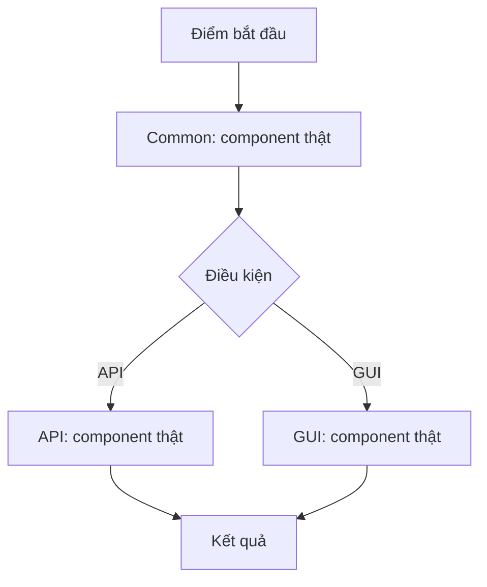

# Implementation Plan: [Tên tính năng/task] · [ENG-XXXX]

> **TL;DR**
> - **Goal**: [1 câu — làm gì, cho ai]
> - **Scope**: [Common + API + GUI / chỉ API / chỉ GUI]
> - **Phases**: [N] — trình tự ở section 4
> - **Main risk**: [1 dòng, hoặc N/A]
> - **Done when**: [tiêu chí nghiệm thu tổng, 1 dòng]

---

## 1. Context & Current State

> Nơi **duy nhất** mô tả hiện trạng. Sub-plan không lặp lại section này.

- **Existing**: [thành phần/luồng hiện tại — kèm `file:line`]
- **Missing**: [khoảng trống cần lấp]
- **Constraints**: [ràng buộc kỹ thuật/nghiệp vụ phải tuân thủ — kèm `file:line`]
- **Pattern to follow**: [`path/to/file.ts:42` — mô tả 1 dòng]

## 2. Design Decisions

> Nơi **duy nhất** ghi hướng tiếp cận và nguyên tắc refactor. Sub-plan chỉ ghi phần lệch.

- **Chosen approach**: [giải pháp — 1–3 bullet]
- **Rejected**: [phương án bị loại] — vì [lý do ngắn]

### Refactor principles that shaped this design

Chỉ ghi nguyên tắc **thực sự làm thay đổi một quyết định** trong plan này. Nguyên tắc không tác động → ghi `N/A`. Không chép lại định nghĩa nguyên tắc.

- **KISS**: [quyết định cụ thể / N/A]
- **DRY**: [logic dùng chung đặt ở đâu / N/A]
- **YAGNI**: [abstraction bị loại khỏi scope / N/A]
- **SOLID**: [ranh giới trách nhiệm / N/A]
- **Clean Code**: [quy ước áp dụng / N/A]
- **Performance**: [điểm cần lưu ý / N/A]
- **Error handling**: [hợp đồng lỗi giữa API và GUI / N/A]

## 3. Flow Diagram

[Dựa trên component/file thật đã tìm ở bước nghiên cứu, không dùng box chung chung. Nếu task không có luồng đáng kể (ví dụ đổi 1 dòng config), ghi rõ "Không có luồng xử lý đáng kể" thay vì bỏ trống.]

## 4. Work Matrix

> Nơi **duy nhất** liệt kê hạng mục và trình tự. Mỗi hạng mục đúng **1 dòng**, trỏ tới đúng **1 phase** ở đúng **1 sub-plan**. Không mô tả implementation ở đây.

| # | Item | Scope | Phase | Depends on | Detailed in |
|---|---|---|---|---|---|
| 1 | [tên hạng mục] | Common | Phase 1 | — | `...-common.md` |
| 2 | [tên hạng mục] | API | Phase 1 | #1 | `...-api.md` |
| 3 | [tên hạng mục] | GUI | Phase 1 | #2 | `...-gui.md` |

*Scope nào không có việc → ghi 1 dòng lý do tại đây và không tạo file sub-plan tương ứng. Ví dụ: "Không có phần Common — task chỉ đụng UI, không thêm type/schema dùng chung."*

## 5. Out of Scope

> Nơi **duy nhất** — áp dụng cho cả 3 sub-plan.

- [việc cố ý không làm] — [lý do ngắn]

## 6. End-to-End Verification

> Nơi **duy nhất** cho kiểm thử xuyên suốt. Verify trong phạm vi từng phase nằm ở sub-plan.

- **Automated**: `[lệnh]`
- **Manual**: [bước 1] → [bước 2] → [kết quả mong đợi]
- **Edge cases**: [trường hợp cần thử tay / N/A]

## 7. References

> Nơi **duy nhất** — sub-plan chỉ trỏ ngược về file này.

- Ticket: `[đường dẫn]`
- Research/spec: `[đường dẫn]`
- Refactor skill: `/skills/refactor/SKILL.md`
- Sub-plans: `...-common.md` · `...-api.md` · `...-gui.md`
