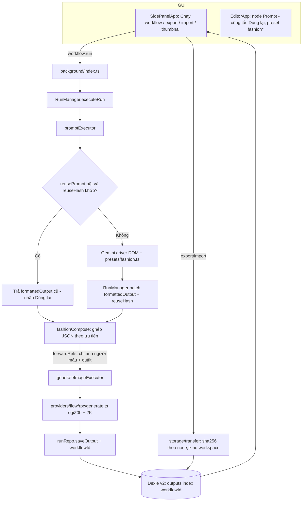

# Implementation Plan: Workflow tạo hình thời trang (Flow) + export/import workspace + thumbnail

> **TL;DR**
> - **Goal**: Workflow tạo hình thời trang trên Google Flow: phân tích scene, người mẫu, outfit, phối màu bằng Gemini rồi tạo hình 2K; mỗi lần chỉ đổi ảnh outfit và bấm "Chạy workflow".
> - **Scope**: Common + API (service worker, engine, provider) + GUI
> - **Phases**: 6 (Phase 0-5) - trình tự ở section 4
> - **Main risk**: Flow có thể không có RPC xuất ảnh 2K; Phase 0 là spike, không đạt thì dừng lại hỏi người dùng.
> - **Done when**: Đổi ảnh outfit rồi bấm "Chạy workflow" ra hình 2K với chỉ 1-2 lượt Gemini; workflow video cũ chạy y như trước; export/import workspace không tráo ảnh; danh sách workflow có dải thumbnail và số lượng.

---

## 1. Context & Current State

- **Existing**:
  - Node Prompt gọi Gemini qua driver DOM, có preset `analyzeImage` và gửi nhiều ảnh trong một lần gọi (`src/engine/executors.ts:207`, `src/engine/executors.ts:223`).
  - Node Prompt chuyển tiếp mọi ảnh đầu vào xuống node phía sau (`src/engine/executors.ts:246`).
  - Kết quả Prompt được lưu vào `formattedOutput` của node (`src/engine/RunManager.ts:586`, schema `src/shared/schema/index.ts:117`).
  - Generate Image tạo ảnh qua RPC `ogiZ0b`, chưa truyền độ phân giải (`src/providers/flow/rpc/generate.ts:505`); field `resolution` (720/1080) có trên UI nhưng không được dùng (`src/features/editor/EditorApp.tsx:1005`, `src/shared/schema/index.ts:68`).
  - Chạy "Chạy node" / chế độ `only` chạy lại toàn bộ node phía trước, chỉ node generator được dùng lại kết quả cũ (`src/engine/RunManager.ts:264`, `src/engine/RunManager.ts:388`).
  - Export/import workflow và backup đã có (`src/storage/transfer/index.ts`), UI ở sidepanel (`src/features/sidepanel/SidePanelApp.tsx:159`).
  - Template seed dựng sẵn workflow (`src/templates/seed/index.ts`).
  - Ảnh local được upload lên Flow (`maseQ`) ở mỗi lần chạy; cache upload chỉ trong RAM và khoá theo run id (`src/providers/flow/rpc/generate.ts:428`).
  - Node Asset chọn file local ở `src/features/editor/nodes/WorkflowNodeView.tsx:463`.
- **Missing**:
  - Preset phân tích thời trang, node ghép prompt theo thứ tự ưu tiên, cơ chế dùng lại prompt khi đầu vào không đổi.
  - Tuỳ chọn không chuyển tiếp ảnh (ảnh mẫu scene không được đi sang Flow).
  - Độ phân giải 2K cho ảnh.
  - Export/import theo workspace; dải thumbnail và số lượng output trên danh sách workflow.
- **Constraints**:
  - Cache kết quả chỉ nằm trong RAM của service worker và hash ảnh chỉ theo `size`/`type` (`src/engine/RunManager.ts:54`, `src/engine/cache.ts:5`): hai ảnh cùng dung lượng bị coi là một.
  - Import gán ảnh vào node Asset theo thứ tự, không theo hash (`src/storage/transfer/index.ts:520`): workflow nhiều ảnh bị tráo ảnh.
  - Bảng `outputs` không có `workflowId` (`src/storage/db.ts:67`); output được ghi ở `src/storage/repos/runRepo.ts:128`.
  - Danh sách preset bị lặp ở 3 nơi (`src/features/editor/EditorApp.tsx:946`, `src/features/runner/selectors.ts:14`, `src/features/runner/GenerateItemList.tsx:20`).
  - Quy tắc repo: đổi shape dữ liệu thì tăng `SCHEMA_VERSION` (hiện 5, `src/shared/schema/index.ts:8`) và thêm nhánh `migrateWorkflow` (`src/shared/schema/index.ts:497`); UI chỉ tiếng Việt qua `strings.ts`; Flow generate chỉ qua RPC; asset Flow không upload lại; không log token/captcha.
- **Pattern to follow**:
  - `src/engine/executors.ts:172` - lookup map `PRESET_SYSTEM` cho system prompt theo preset.
  - `src/templates/seed/index.ts:5` - template built-in dựng sẵn node và cạnh.
  - `tests/unit/node-pipeline.test.ts`, `tests/unit/run-only-node.test.ts` - test engine với fake-indexeddb.

## 2. Design Decisions

- **Chosen approach**:
  - Dùng chung engine và loại node hiện có; tách toàn bộ logic thời trang vào `src/engine/presets/fashion.ts` (system prompt, JSON schema, hàm ghép prompt thuần).
  - Node Prompt có công tắc `reusePrompt`: bật thì dùng lại `formattedOutput` khi `reuseHash` (hash nội dung ảnh + instruction + model + preset + text đầu vào) không đổi; khác hash hoặc chưa có kết quả thì gọi Gemini. Node mới mặc định bật; migration đặt node cũ là tắt để workflow video giữ hành vi.
  - Node Prompt có `forwardRefs` (mặc định bật); preset `fashionScene` đặt tắt khi chọn preset để ảnh mẫu không sang Flow.
  - Preset `fashionCompose` ghép prompt tại chỗ, không gọi AI: parse JSON từng khối theo `type` và xếp thứ tự người mẫu > outfit > phối màu > scene.
  - Phối màu: chọn phong cách (sang trọng / trẻ đẹp / năng động) bằng instruction của node, template điền sẵn; preset trả về 1 palette.
  - Nhiều ảnh mẫu: nối nhiều Asset vào một node `fashionScene` (trường hợp 2), không cần sửa engine.
  - Asset Flow khi export giữ media id; bên nhận thấy cảnh báo thiếu ảnh và tự chọn lại.
  - Thumbnail/đếm: thêm `workflowId` vào bảng `outputs` (Dexie v2 + backfill) để truy vấn theo index.
  - Asset local upload lên Flow **ngay khi chọn ảnh**; lưu `uploadedMediaId`, `uploadedProjectId`, `uploadedSha256` vào node và dùng lại. Id bị bỏ khi đổi file, đổi project, hoặc Flow báo media không còn (upload lại từ file gốc, không phải retry generate). Chọn ảnh lúc chưa mở tab Flow → node báo lỗi, có nút "Upload lại"; lần chạy đầu vẫn upload và lưu id.
  - Export bỏ `uploaded*` (gắn với tài khoản); ảnh local vẫn được đóng gói.
  - Node Prompt có nút "Phân tích" / "Phân tích lại" (chạy node + Asset phía trước; "Phân tích lại" gửi `force` để bỏ qua dùng lại), ô "Skill" sửa được theo từng node (`systemPrompt`, trống = mặc định của preset) và ô "Kết quả" sửa tay được.
  - Kết quả đã sửa tay (`outputEdited: true`) luôn được giữ, kể cả khi đầu vào đổi; node hiện nhãn "Đã sửa tay". Chỉ "Phân tích lại" mới xoá cờ này.
- **Rejected**:
  - Tách engine hoặc tab "Image" riêng - nhân đôi scheduler/runner, ngoài phạm vi "chỉ tab Workflow".
  - "Luôn dùng lại" không kiểm tra đầu vào - đổi ảnh outfit vẫn ra phân tích cũ mà không báo lỗi.
  - Tạo ảnh bằng Gemini Spark - chưa xác định được chức năng, driver DOM dễ vỡ.
  - Tải ảnh gốc từ Flow để đóng gói khi export - người dùng chọn giữ media id.
  - Đếm output bằng cách join runs → nodeRuns → outputs mỗi lần render - quét toàn bảng.
  - Lưu id upload vào `flowMediaId` - field này nghĩa là "asset gốc Flow": export sẽ bỏ file và luật không upload lại sẽ chặn node.
  - Sửa skill toàn cục theo preset - không đi kèm file export, đổi ngầm mọi workflow.

### Refactor principles that shaped this design

- **KISS**: Ghép prompt là hàm thuần trên JSON, không gọi Gemini; công tắc dùng lại là một so sánh hash, không thêm hệ thống cache mới.
- **DRY**: Danh sách preset gom về một hằng `PROMPT_PRESETS` trong schema thay cho 3 bản lặp; hàm `hashBlobContent` dùng chung cho reuse, cache engine và export/import.
- **YAGNI**: Không làm fan-out nhiều ảnh (trường hợp 3), không làm field riêng cho phong cách màu (dùng instruction), không đóng gói ảnh Flow.
- **SOLID**: Logic thời trang nằm trong `engine/presets/fashion.ts`; `promptExecutor` chỉ tra map, không biết chi tiết thời trang.
- **Clean Code**: Tên preset có tiền tố `fashion*`; hằng số độ phân giải đặt tên (`IMAGE_RESOLUTIONS`), không dùng số ma thuật.
- **Performance**: Hash nội dung ảnh một lần mỗi blob mỗi lần chạy và dùng lại; thumbnail/đếm đi qua index `workflowId`, gom một lần truy vấn cho cả danh sách.
- **Error handling**: Parse JSON output Gemini bằng helper an toàn; khối JSON hỏng thì node báo lỗi rõ ràng bằng tiếng Việt, không âm thầm bỏ qua; import file lỗi hoặc thiếu ảnh hiện cảnh báo trong preview.

## 3. Flow Diagram

## 4. Work Matrix

| # | Item | Scope | Phase | Depends on | Detailed in |
|---|---|---|---|---|---|
| 1 | Spike RPC xuất ảnh 2K và kiểm tra watermark trên Flow | API | Phase 0 | - | `...-api.md` |
| 2 | Schema v6: `reusePrompt`, `reuseHash`, `forwardRefs`, preset `fashion*`, `PROMPT_PRESETS`, độ phân giải ảnh + migration | Common | Phase 1 | #1 | `...-common.md` |
| 3 | Dexie v2: `outputs.workflowId` + backfill, ghi `workflowId` khi lưu output, truy vấn thống kê | Common | Phase 1 | - | `...-common.md` |
| 4 | Helper `hashBlobContent` (SHA-256 nội dung) | Common | Phase 1 | - | `...-common.md` |
| 5 | Chuỗi UI mới trong `strings.ts` | Common | Phase 1 | - | `...-common.md` |
| 6 | Module `engine/presets/fashion.ts`: system prompt + JSON schema 4 preset, `fashionCompose` | API | Phase 2 | #2 | `...-api.md` |
| 7 | Logic dùng lại prompt trong `promptExecutor` + patch `reuseHash` | API | Phase 2 | #2, #4 | `...-api.md` |
| 8 | Xử lý `forwardRefs = false` | API | Phase 2 | #2 | `...-api.md` |
| 9 | Sửa hash cache engine theo nội dung ảnh | API | Phase 2 | #4 | `...-api.md` |
| 10 | Truyền độ phân giải 2K xuống RPC tạo ảnh | API | Phase 2 | #1, #2 | `...-api.md` |
| 11 | Template seed "Tạo hình thời trang" | API | Phase 2 | #6 | `...-api.md` |
| 12 | Test hồi quy workflow video | API | Phase 2 | #7, #8 | `...-api.md` |
| 13 | Export lưu `sha256` theo node Asset, import ghép ảnh theo hash | Common | Phase 3 | #4 | `...-common.md` |
| 14 | Export/import theo workspace (`kind: 'workspace'`) | Common | Phase 3 | #13 | `...-common.md` |
| 15 | Cảnh báo asset Flow thiếu khi import | Common | Phase 3 | #13 | `...-common.md` |
| 16 | Node Prompt: chọn preset từ `PROMPT_PRESETS`, công tắc Dùng lại, công tắc chuyển tiếp ảnh, nhãn trạng thái | GUI | Phase 4 | #7, #8 | `...-gui.md` |
| 17 | Generate Image: chọn độ phân giải ảnh | GUI | Phase 4 | #10 | `...-gui.md` |
| 18 | Sidepanel: nút export/import workspace | GUI | Phase 4 | #14 | `...-gui.md` |
| 19 | Sidepanel: dải 3-4 thumbnail + dòng đếm "N ảnh · M video" | GUI | Phase 4 | #3 | `...-gui.md` |
| 20 | Schema v7: Asset `uploadedMediaId/uploadedProjectId/uploadedSha256`; Prompt `systemPrompt`, `outputEdited` + migration | Common | Phase 5 | - | `...-common.md` |
| 21 | Export bỏ `uploaded*` khỏi node Asset | Common | Phase 5 | #20 | `...-common.md` |
| 22 | Chuỗi UI cho upload Flow và panel phân tích | Common | Phase 5 | - | `...-common.md` |
| 23 | Message `asset.uploadToFlow` + handler SW upload `maseQ` và patch node | API | Phase 5 | #20 | `...-api.md` |
| 24 | `resolveRefs` dùng lại `uploadedMediaId`; thiếu/lệch thì upload và lưu id; media không còn thì upload lại 1 lần | API | Phase 5 | #20 | `...-api.md` |
| 25 | `promptExecutor`: `systemPrompt` ghi đè, `outputEdited` luôn dùng lại, `force` bỏ qua dùng lại | API | Phase 5 | #20 | `...-api.md` |
| 26 | `workflow.run` thêm `force?: boolean` cho chế độ `node` | API | Phase 5 | #25 | `...-api.md` |
| 27 | Node Asset: upload ngay khi chọn, nhãn "Đã có trên Flow" / lỗi, nút "Upload lại" | GUI | Phase 5 | #23 | `...-gui.md` |
| 28 | Panel node Prompt: nút Phân tích / Phân tích lại, ô Skill + Khôi phục mặc định, ô Kết quả sửa được + nhãn "Đã sửa tay" | GUI | Phase 5 | #25, #26 | `...-gui.md` |

## 5. Out of Scope

- Nhiều ảnh mẫu ra nhiều hình (fan-out, trường hợp 3) - để sau, cần sửa engine.
- Tạo ảnh bằng Gemini Spark - chưa xác định chức năng.
- Đóng gói file ảnh của asset Flow khi export - người dùng chọn giữ media id.
- Export kèm output đã tạo (`includeOutputs`) - không có yêu cầu.
- Tự retry khi generate lỗi - trái quy tắc repo.

## 6. End-to-End Verification

- **Automated**: `pnpm typecheck` · `pnpm test` · `pnpm build`
- **Manual**:
  - Tạo workflow từ template "Tạo hình thời trang" → chọn ảnh mẫu, người mẫu, outfit → "Chạy workflow" → có hình 2K tải về.
  - Đổi ảnh outfit → "Chạy workflow" → node scene và người mẫu hiện "Dùng lại", node outfit hiện "Mới phân tích", Console ghi đúng 1-2 lần gọi Gemini.
  - Chạy lại một workflow video cũ ("Trước Gương 3") → hành vi và prompt gửi Flow không đổi.
  - Export workspace → import vào profile Chrome khác → ảnh đúng node, asset Flow có cảnh báo thiếu.
  - Danh sách workflow hiện dải thumbnail và số ảnh/video đúng.
- **Edge cases**: hai ảnh outfit khác nhau nhưng cùng dung lượng; Gemini trả JSON hỏng; import file từ extension mới hơn; workflow chưa có output (không thumbnail); output video không có poster.
- **Execution protocol** (mỗi phase):
  1. Subagent code (`general-purpose`) chỉ nhận đường dẫn phase trong sub-plan và các dòng work matrix tương ứng.
  2. Subagent `reviewer` đọc diff của phase, trả findings và verification contract.
  3. Subagent `verifier` chạy `pnpm typecheck` · `pnpm test`; phase có UI thì `pnpm build` rồi dùng `playwright-cli` load `dist/`, chụp màn hình trang editor/sidepanel.
  4. Có finding → gửi tiếp cho subagent code cũ qua `SendMessage`, không mở subagent mới.
  5. Bước chạy thật trên Gemini/Flow là verify thủ công của người dùng (subagent không đăng nhập Google).

## 7. References

- Thảo luận yêu cầu: phiên chat ngày 2026-09-26 (không có ticket).
- Tài liệu: `docs/WORKFLOW.md` · `docs/providers/flow.md` · `docs/providers/gemini.md`
- Refactor skill: `.claude/skills/refactor/SKILL.md`
- Sub-plans: `2026-09-26-fashion-image-workflow-common.md` · `2026-09-26-fashion-image-workflow-api.md` · `2026-09-26-fashion-image-workflow-gui.md`
