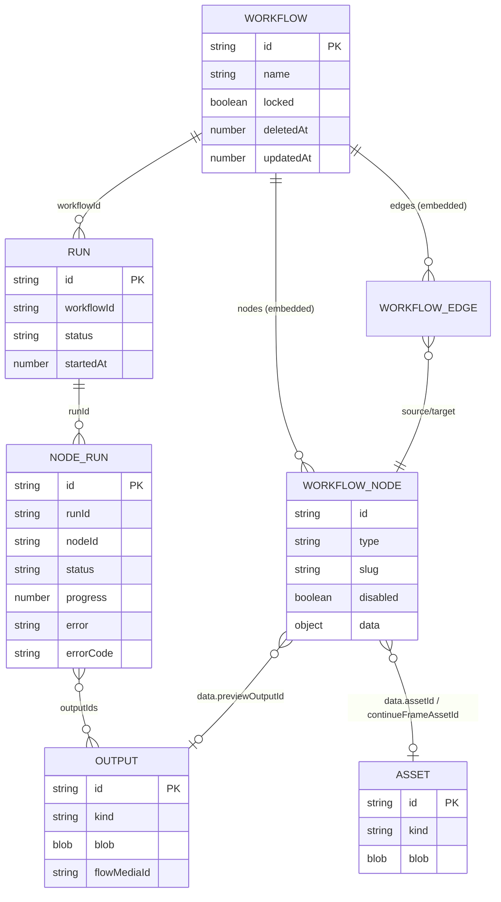
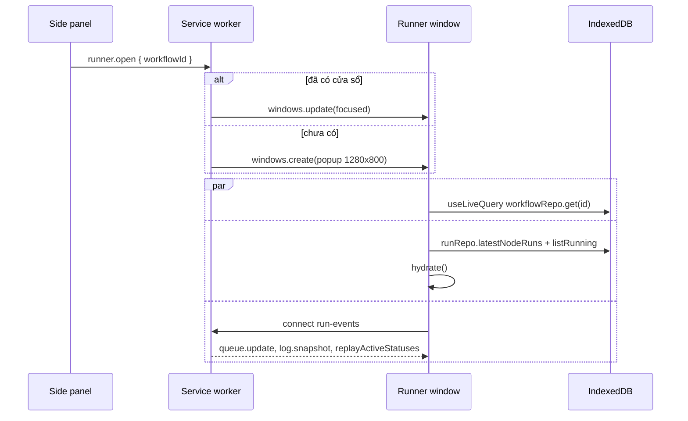
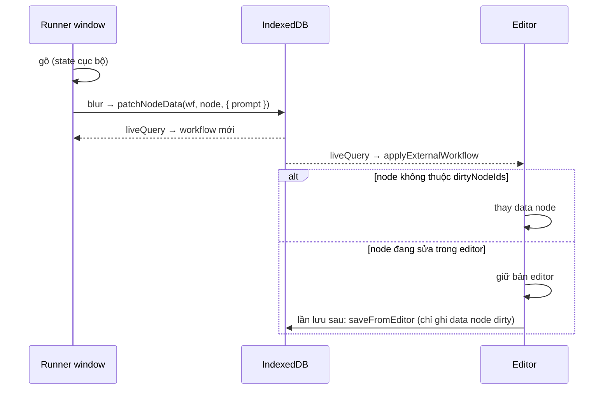
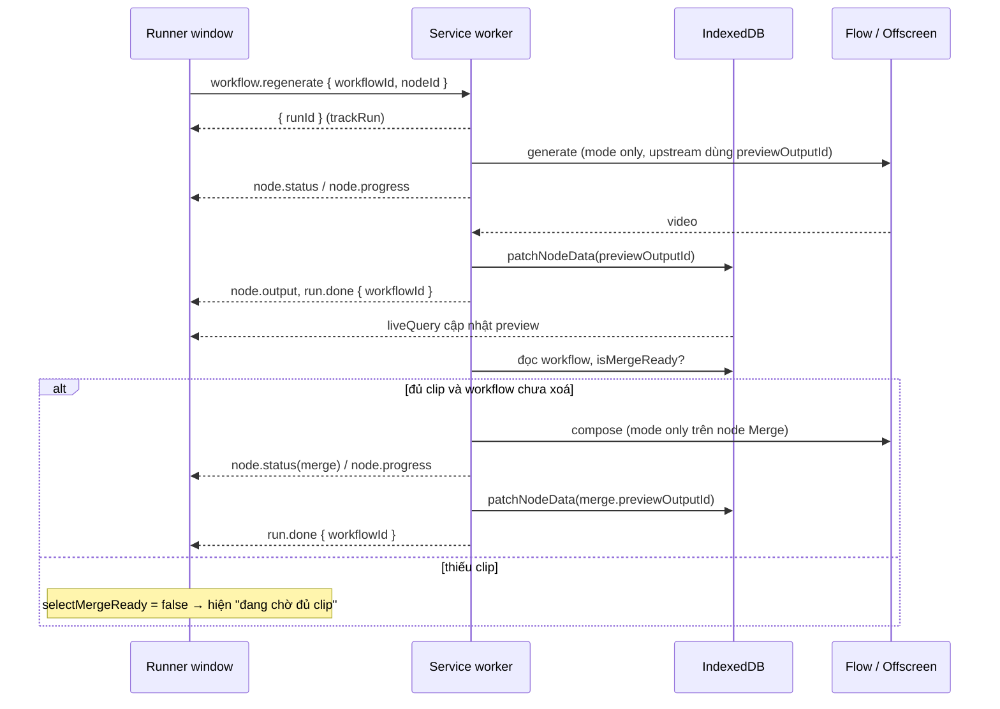

# Data Contract: Cửa sổ "Chạy" cho workflow (Workflow Input Window)

> Date: 2026-09-17 · Status: Đã chốt với user
> Yêu cầu nguồn: `docs/specs/workflow-input-window/detail-spec.md`
> Quy ước áp dụng: `.claude/commands/references/db-schema-conventions.md`, `.claude/commands/references/gui-store-conventions.md`

## 0. Tóm tắt quyết định

| # | Quyết định | Lựa chọn đã chốt | Phương án bị loại |
|---|---|---|---|
| D1 | Chống ghi đè khi cửa sổ "Chạy", editor, SW cùng ghi workflow | Patch theo field trong transaction Dexie (`patchNodeData`), không tạo revision | Kiểm tra `updatedAt` rồi ghi lại cả workflow; SW là nơi ghi duy nhất |
| D2 | Trạng thái/lỗi gần nhất của node khi mở lại cửa sổ | Đọc từ `nodeRuns` có sẵn (`runRepo.latestNodeRuns`) | Lưu `lastStatus` vào node data (tăng schema); chỉ realtime |
| D3 | Tạo lại + tự ghép | Message mới `workflow.regenerate`, SW điều phối | Cờ `thenMerge` trong `workflow.run`; UI điều phối |
| D4 | Store cửa sổ "Chạy" | `useLiveQuery` cho workflow + Zustand nhỏ `useRunnerStore` cho trạng thái chạy | Dùng lại `useEditorStore`; state cục bộ |
| D5 | Editor nhận thay đổi từ bên ngoài | Gộp theo node: node editor chưa sửa thì nhận data mới, node đang sửa giữ bản editor; editor lưu bằng `saveFromEditor` | Luôn lấy bản DB; editor bỏ mô hình dirty |
| D6 | Mở cửa sổ | Page `runner`, message `runner.open`; khai báo luôn `editor.open` | Dùng chung `editor.open` với field `view` |
| D7 | Xoá workflow khi đang chạy | Thao tác xoá ở side panel luôn gửi `workflow.cancel` | Cửa sổ "Chạy" tự gửi cancel |

**Không đổi shape dữ liệu đã lưu:** không tăng `SCHEMA_VERSION` (giữ `5`), không thêm bảng, không thêm index Dexie.

---

## A. DB schema (IndexedDB / Dexie)

### A.1 Entity dùng tới (không thay đổi)

| Bảng | Entity | Field dùng trong tính năng | Ghi chú |
|---|---|---|---|
| `workflows` | `Workflow` | `id`, `name`, `locked`, `deletedAt`, `nodes`, `edges`, `updatedAt` | Nguồn sự thật duy nhất (BR-06) |
| (trong `Workflow.nodes`) | `WorkflowNode` | `id`, `type`, `slug`, `label`, `disabled`, `data` | Node `disabled` bị ẩn (BR-14d) |
| `assets` | `AssetRecord` | `id`, `blob`, `mime`, `kind`, `originalName` | Upload local qua `assetRepo.put` |
| `runs` | `Run` | `id`, `workflowId`, `status`, `startedAt`, `mode` | Index `workflowId`, `startedAt` đã có |
| `nodeRuns` | `NodeRun` | `runId`, `nodeId`, `status`, `progress`, `message`, `error`, `errorCode`, `finishedAt` | Index `runId`, `nodeId` đã có |
| `outputs` | `OutputRecord` | `id`, `blob`, `kind`, `mime`, `flowMediaId` | Preview qua `previewOutputId` |

### A.2 Node data dùng tới

| Node type | Field đọc | Field cửa sổ "Chạy" ghi | Field SW ghi |
|---|---|---|---|
| `asset` | `assetLabel`, `kind`, `source`, `assetId`, `flowMediaId`, `flowPreviewUrl`, `originalName`, `mime`, `missing` | `assetId`, `source`, `flowMediaId`, `flowPreviewUrl`, `originalName`, `mime`, `missing` (không ghi `kind`, BR-02) | Không |
| `prompt` | `preset`, `instruction`, `formattedOutput`, `continueFrameAssetId` | `preset`, `instruction` | `formattedOutput` |
| `generateVideo` | `prompt`, `model`, `aspectRatio`, `durationSec`, `previewOutputId` | `prompt`, `model`, `aspectRatio`, `durationSec` (không ghi `count`, BR-11) | `previewOutputId` |
| `generateImage` | `prompt`, `model`, `aspectRatio`, `previewOutputId` | `prompt`, `model`, `aspectRatio` | `previewOutputId` |
| `mergeVideo` | `order`, `previewOutputId` | `order` | `previewOutputId` |

### A.3 Relationships

- `Workflow 1 - N WorkflowNode` (nhúng trong document).
- `WorkflowEdge.source/target → WorkflowNode.id` (nhúng, xác định node Prompt nối vào generate và clip nối vào Merge).
- `Workflow 1 - N Run 1 - N NodeRun` (`runs.workflowId`, `nodeRuns.runId`).
- `NodeRun.outputIds N - 1 OutputRecord`; `node.data.previewOutputId → OutputRecord.id`.
- `asset.data.assetId → AssetRecord.id`; `prompt.data.continueFrameAssetId → AssetRecord.id`.
- Toàn vẹn ở tầng ứng dụng (không FK). Workflow xoá mềm (`deletedAt`), không cascade.

### A.4 ERD



### A.5 Migration outline

- Không có migration: không đổi `SCHEMA_VERSION`, không đổi `this.version(n).stores(...)`.
- Workflow cũ (v3 đến v5) và file import vẫn đi qua `upgradeStoredWorkflow` như hiện tại.
- Đồng bộ tài liệu: `docs/WORKFLOW.md` đang ghi `SCHEMA_VERSION` là `3`, cần sửa thành `5` trong cùng thay đổi.

### A.6 Persistence / repository layer

**`workflowRepo` (`src/storage/repos/workflowRepo.ts`)**

| Method | Mới/cũ | Hành vi |
|---|---|---|
| `get(id)` | Cũ | Đọc workflow (kể cả đã xoá mềm; cửa sổ dựa vào `deletedAt` để hiện thông báo) |
| `patchNodeData(workflowId, nodeId, patch)` | **Mới** | Trong `db.transaction('rw', db.workflows)`: đọc bản mới nhất, gộp `patch` vào `data` của đúng node, `validateNodeData`, bump `updatedAt`, `put`. Không tạo revision, không xoá draft. Trả `Workflow \| undefined`. Node không tồn tại hoặc workflow đã xoá → ném lỗi `WORKFLOW_NODE_NOT_FOUND` / `WORKFLOW_DELETED` |
| `saveFromEditor(workflow, dirtyNodeIds)` | **Mới** | Transaction: đọc bản DB; lấy cấu trúc (danh sách node, vị trí, cạnh, name, settings, locked...) từ editor; với node có ở cả hai bên, `data` lấy từ editor nếu `nodeId ∈ dirtyNodeIds`, ngược lại lấy từ DB. Giữ nguyên cơ chế revision và xoá draft như `save` |
| `save(workflow)` | Cũ | Giữ cho import/duplicate/template; editor và SW không dùng để ghi node data nữa |
| `softDelete(id)` | Cũ | Không đổi; phía gọi (side panel) gửi thêm `workflow.cancel` (D7) |

**`runRepo` (`src/storage/repos/runRepo.ts`)**

| Method | Mới/cũ | Hành vi |
|---|---|---|
| `latestNodeRuns(workflowId, limit = 20)` | **Mới** | Lấy `limit` run mới nhất của workflow (`listByWorkflow`), đọc `nodeRuns` theo `runId`, trả `Map<nodeId, NodeRun>` với bản ghi mới nhất cho mỗi node (so theo `finishedAt ?? startedAt`, rồi theo `run.startedAt`) |
| `listRunning()` | Cũ | Cửa sổ lọc theo `workflowId` để biết run đang chạy khi mở |

**`assetRepo`:** dùng `put(blob, originalName, workflowId)` có sẵn cho upload local.

**Chỗ ghi phía SW phải đổi sang patch (`src/engine/RunManager.ts`):**
- Gắn `previewOutputId` sau khi generate/merge thành công → `patchNodeData`.
- Gắn `formattedOutput` cho node Prompt → `patchNodeData`.
- Đầu `executeRun` và trước bước tự ghép: workflow có `deletedAt` → dừng, không chạy (vì `cancelByWorkflow` chỉ huỷ run đang active, không huỷ job còn trong hàng đợi).

---

## B. GUI store

### B.1 Tổng quan

| Dữ liệu | Loại | Nơi giữ | Cập nhật |
|---|---|---|---|
| Workflow (node, cạnh, name, locked, deletedAt) | Persisted | `useLiveQuery(() => workflowRepo.get(id))` | Tự chạy lại khi editor/SW/cửa sổ ghi Dexie |
| Output/asset blob để preview | Persisted | Hook `useOutputUrl` / `useMediaUrl` có sẵn | Theo `previewOutputId` |
| Trạng thái chạy từng node | Runtime | `useRunnerStore.nodeStatus` | `hydrate` khi mở + `applyEvent` từ `run-events` |
| Run đang theo dõi | Runtime | `useRunnerStore.trackedRunIds` | `trackRun` sau `workflow.run`/`workflow.regenerate`, `hydrate`, `applyEvent` |
| Chữ đang gõ trong ô | UI-only | State cục bộ của component ô nhập | Ghi `patchNodeData` khi blur (BR-06a) |
| Ô/mục hiển thị, thứ tự, trạng thái "chờ đủ clip" | Derived | Selector thuần | Tính lại theo workflow + `nodeStatus` |

### B.2 Store `useRunnerStore` (`src/features/runner/store.ts`)

```ts
import type { NodeRun, NodeRunStatus } from '@/shared/schema';
import type { SwToUiEvent } from '@/shared/messaging';

/** Trạng thái chạy gần nhất của một node. Runtime-only, không persist. */
export interface RunnerNodeStatus {
  runId: string;
  status: NodeRunStatus;
  progress?: number;
  message?: string;
  error?: string;
  errorCode?: string;
}

export interface RunnerState {
  workflowId: string | null;
  /** key = WorkflowNode.id */
  nodeStatus: Record<string, RunnerNodeStatus>;
  /** Run của workflow này đang chạy/chờ. */
  trackedRunIds: string[];

  hydrate: (input: RunnerHydrateInput) => void;
  applyEvent: (ev: SwToUiEvent, nodeIds: ReadonlySet<string>) => void;
  trackRun: (runId: string) => void;
  reset: () => void;
}

export interface RunnerHydrateInput {
  workflowId: string;
  latestNodeRuns: Map<string, NodeRun>;
  runningRunIds: string[];
}
```

Quy tắc `applyEvent`:
- `node.status` / `node.progress`: bỏ qua nếu `nodeId ∉ nodeIds`; ngược lại ghi đè `nodeStatus[nodeId]` (`error` lấy từ `message` khi `status === 'error'`, giống editor).
- `node.status` có `runId` chưa theo dõi và node thuộc workflow → thêm vào `trackedRunIds` (bắt được cả run do editor khởi chạy).
- `node.output` / `node.data`: không đổi store; workflow tự cập nhật qua `useLiveQuery` vì SW đã patch Dexie.
- `run.done`: nếu `ev.workflowId === workflowId` hoặc `runId ∈ trackedRunIds` → bỏ khỏi `trackedRunIds`; node của run đó còn `queued`/`running` → chuyển theo `ev.status` (`cancelled`/`error`).
- `queue.update`, `log`, `log.snapshot`: bỏ qua.

### B.3 Selectors (`src/features/runner/selectors.ts`, hàm thuần, có unit test)

```ts
import type { AssetLabel, Workflow, WorkflowNode } from '@/shared/schema';

export interface RunnerAssetSlot {
  nodeId: string;
  slug?: string;
  label: AssetLabel;
  kind: 'image' | 'video' | 'audio';
  source?: 'local' | 'flow';
  assetId?: string;
  flowMediaId?: string;
  flowPreviewUrl?: string;
  originalName?: string;
  missing: boolean;
}

export interface RunnerGenerateItem {
  nodeId: string;
  slug?: string;
  type: 'generateImage' | 'generateVideo';
  prompt: string;
  model: string;
  aspectRatio: string;
  /** Chỉ generateVideo. */
  durationSec?: number;
  previewOutputId?: string;
  /** Node Prompt (không disabled) nối trực tiếp vào cổng text của node này. */
  promptNodes: RunnerPromptRef[];
  /** true nếu node nối vào node Merge. */
  inMerge: boolean;
}

export interface RunnerPromptRef {
  nodeId: string;
  slug?: string;
  preset: PromptPreset;
  instruction: string;
  formattedOutput?: string;
}

export interface RunnerMergeInfo {
  nodeId: string;
  slug?: string;
  order: string[];
  previewOutputId?: string;
  /** Id node nguồn theo thứ tự ghép (orderedClipIds). */
  clipNodeIds: string[];
}
```

| Selector | Trả về | Quy tắc |
|---|---|---|
| `selectVisibleNodes(wf)` | `WorkflowNode[]` | Bỏ node `disabled`, `note`, `unknown`, `text` (BR-14d, EC-15) |
| `selectAssetSlots(wf)` | `RunnerAssetSlot[]` | Mỗi node `asset` hiển thị một ô, theo thứ tự chạy (BR-01) |
| `selectMergeInfo(wf)` | `RunnerMergeInfo \| null` | Node `mergeVideo` đầu tiên không disabled; `null` thì ẩn khung video cuối |
| `selectGenerateItems(wf)` | `RunnerGenerateItem[]` | Clip của Merge theo `clipNodeIds`, sau đó node còn lại theo thứ tự `topoSort` (BR-12) |
| `selectMergeReady(wf)` | `boolean` | Mọi node video trong `clipNodeIds` có `previewOutputId` (BR-10, "có video là đủ") |
| `selectIsRunning(state)` | `boolean` | `trackedRunIds.length > 0` |
| `selectCanEdit(wf)` | `boolean` | `!wf.locked && !wf.deletedAt` (BR-07, AC-07.6) |

`PromptPreset` là `PromptNodeData['preset']`; tất cả type node data lấy từ `@/shared/schema`, không định nghĩa lại.

### B.4 Actions phía UI (`src/features/runner/actions.ts`)

| Action | Việc làm | Gọi |
|---|---|---|
| `loadRunnerState(workflowId)` | Khi mount: `runRepo.latestNodeRuns` + `runRepo.listRunning()` lọc theo workflow → `hydrate` | Repo |
| `updateNodeField(workflowId, nodeId, patch)` | Khi blur ô / đổi select / đổi preset | `workflowRepo.patchNodeData` |
| `pickLocalAsset(workflowId, slot, file)` | Kiểm tra `mediaKindOf(file) === slot.kind` (sai → lỗi, giữ cũ, BR-02); `assetRepo.put`; patch `assetId`, `source: 'local'`, `mime`, `originalName`, `missing: false`, xoá `flowMediaId`/`flowPreviewUrl` | Repo |
| `pickFlowAsset(workflowId, slot, item)` | Kiểm tra `item.kind === slot.kind`; patch `source: 'flow'`, `flowMediaId`, `flowPreviewUrl`, xoá `assetId` | Repo (`FlowAssetPicker` dùng `provider.listFlowMedia` / `signFlowMedia` có sẵn) |
| `moveClip(workflowId, merge, nodeId, dir)` | Tính `order` mới từ `clipNodeIds`, patch `order` | Repo |
| `runAll(workflowId)` | `sendToSw({ type: 'workflow.run', workflowId, mode: 'full' })` → `trackRun(runId)` | Message |
| `stopAll(workflowId)` | `sendToSw({ type: 'workflow.cancel', workflowId })` | Message |
| `regenerate(workflowId, nodeId)` | `sendToSw({ type: 'workflow.regenerate', workflowId, nodeId })` → `trackRun(runId)` | Message |
| `openEditor(workflowId)` | `sendToSw({ type: 'editor.open', workflowId })` | Message |

Các action ghi đều không chạy khi `selectCanEdit` là `false`; `runAll`, `stopAll`, `regenerate`, tải video vẫn chạy khi workflow bị khoá (BR-07). Nút không bị khoá khi đang chạy (BR-14a).

### B.5 Thay đổi ở editor (`src/features/editor/`)

- `useEditorStore` thêm `dirtyNodeIds: Set<string>` (UI-only): `updateNodeData` thêm id; `markSaved` xoá hết. Runtime patch (`setNodePreview`, `node.data`) không thêm id.
- `EditorApp` lưu bằng `workflowRepo.saveFromEditor(store.toWorkflow(), dirtyNodeIds)` thay cho `save`.
- `EditorApp` thêm `useLiveQuery(() => workflowRepo.get(id))`; khi bản DB có `updatedAt` mới hơn lần đồng bộ trước, action mới `applyExternalWorkflow(wf)`:
  - node có trong cả hai và không thuộc `dirtyNodeIds` → thay `data` bằng bản DB;
  - node thuộc `dirtyNodeIds` → giữ bản editor;
  - `name`, `locked` → lấy bản DB nếu editor không sửa;
  - không đẩy thay đổi này vào undo history (dùng `temporal.pause()/resume()`), không bật `dirty`.
- Cấu trúc (thêm/xoá node, cạnh) chỉ editor sửa, nên không gộp chiều ngược.

### B.6 Thay đổi ở side panel

- Item workflow thêm nút "Tải lên" → `sendToSw({ type: 'runner.open', workflowId })`.
- `openEditor` dùng message `editor.open` đã khai báo trong union.
- Xoá workflow: `workflowRepo.softDelete(id)` rồi `sendToSw({ type: 'workflow.cancel', workflowId: id })` (D7).

---

## C. API contract (message) & call workflow

### C.1 Inventory

| Message | Hướng | Mới/cũ | Payload | Response | Phục vụ |
|---|---|---|---|---|---|
| `runner.open` | UI → SW | **Mới** | `RunnerOpenPayload` | `MessageResponse<void>` | Nút "Tải lên" (US-01) |
| `editor.open` | UI → SW | Cũ, **khai báo vào union** | `EditorOpenPayload` | `MessageResponse<void>` | Nút mở editor (side panel, cửa sổ "Chạy") |
| `workflow.regenerate` | UI → SW | **Mới** | `WorkflowRegeneratePayload` | `MessageResponse<WorkflowRegenerateResult>` | `regenerate` (US-05) |
| `workflow.run` | UI → SW | Cũ | `{ workflowId; mode: 'full' }` | `MessageResponse<{ runId: string }>` | `runAll` (US-04) |
| `workflow.cancel` | UI → SW | Cũ | `{ workflowId }` | `MessageResponse` | `stopAll`, xoá workflow |
| `provider.listFlowMedia` / `provider.signFlowMedia` | UI → SW | Cũ | như hiện tại | như hiện tại | `FlowAssetPicker` |
| `node.status`, `node.progress`, `node.output`, `node.data` | SW → UI | Cũ | như hiện tại | - | `applyEvent` |
| `run.done` | SW → UI | Cũ, **thêm `workflowId?`** | `RunDoneEvent` | - | `applyEvent` |

### C.2 Type definitions (`src/shared/messaging/index.ts`)

```ts
export interface RunnerOpenPayload {
  workflowId: string;
}

export interface EditorOpenPayload {
  workflowId: string;
}

export interface WorkflowRegeneratePayload {
  workflowId: string;
  /** Node generateImage/generateVideo cần tạo lại. */
  nodeId: string;
}

export interface WorkflowRegenerateResult {
  /** Run tạo lại node; bước ghép (nếu có) dùng run riêng, báo qua run-events. */
  runId: string;
}

export interface RunDoneEvent {
  runId: string;
  /** Mới, optional để tương thích nơi phát cũ. */
  workflowId?: string;
  status: RunStatus;
  error?: string;
}

export type UiToSwMessage =
  | /* ...các message hiện có... */
  | ({ type: 'runner.open' } & RunnerOpenPayload)
  | ({ type: 'editor.open' } & EditorOpenPayload)
  | ({ type: 'workflow.regenerate' } & WorkflowRegeneratePayload);

export type SwToUiEvent =
  | /* ...các event hiện có, bỏ dòng run.done cũ... */
  | ({ type: 'run.done' } & RunDoneEvent);
```

`isUiToSwMessage` phải nhận thêm ba type mới; nhánh `editor.open` trong listener riêng ở `src/background/index.ts` chuyển vào `handleUiMessage` cùng `runner.open`.

### C.3 Hành vi SW

**`runner.open`:**
- Map riêng `runnerWindows: Map<workflowId, windowId>`, cùng cách làm với `editorWindows`: có cửa sổ thì `chrome.windows.update(focused)`, lỗi thì mở mới.
- `chrome.windows.create({ type: 'popup', width: 1280, height: 800, url: 'src/pages/runner/index.html?id=...' })`; xoá khỏi map khi `windows.onRemoved`.

**`workflow.regenerate`:**
1. Đọc workflow; không có / đã xoá → `{ ok: false, error }`; node không phải generate hoặc disabled → `{ ok: false, error }`.
2. `runManager.runWorkflow(workflowId, { mode: 'only', nodeId })` → trả `runId` ngay (không chờ run xong).
3. Khi run đó kết thúc `success`: đọc lại workflow (bỏ qua nếu `deletedAt`); tìm node `mergeVideo` (không disabled) có node vừa tạo lại trong danh sách clip; `selectMergeReady` (dùng chung hàm thuần với UI, đặt ở `src/engine/` hoặc `src/shared/`) đúng → `runManager.runWorkflow(workflowId, { mode: 'only', nodeId: mergeNodeId })`.
4. Run tạo lại lỗi/huỷ, hoặc chưa đủ clip → không ghép.

Hàm dùng chung cho UI và SW: `isMergeReady(wf, mergeNodeId): boolean` đặt ở `src/engine/mergeReady.ts` (không phụ thuộc React), `selectMergeReady` gọi lại hàm này.

**`run.done`:** mọi chỗ `broadcast({ type: 'run.done', ... })` trong `RunManager` truyền thêm `workflowId`.

### C.4 Trigger point

| Thời điểm UI | Gọi |
|---|---|
| Mount cửa sổ | `useLiveQuery(workflowRepo.get)`, `loadRunnerState`, `connectRunEvents(applyEvent)` (song song) |
| Channel nối lại (SW thức dậy) | SW tự gửi `replayActiveStatuses`; UI gọi lại `loadRunnerState` để lấy lỗi/kết quả đã xảy ra lúc mất kết nối |
| Blur ô prompt / ô cấu hình | `updateNodeField` |
| Đổi select model/tỉ lệ/thời lượng/preset | `updateNodeField` ngay |
| Chọn file / chọn media Flow | `pickLocalAsset` / `pickFlowAsset` |
| Bấm ↑/↓ | `moveClip` |
| Bấm Chạy toàn bộ / Dừng / Tạo lại / Mở editor node | `runAll` / `stopAll` / `regenerate` / `openEditor` |
| Bấm Tải video | Tải `OutputRecord` của `merge.previewOutputId` như `MergeVideoBody` (không cần message) |
| Unmount | `channel.disconnect()`, `reset()`; run không bị huỷ (BR-14b) |

### C.5 Sequence diagrams

**Mở cửa sổ và nạp dữ liệu**



**Sửa prompt (đồng bộ với editor)**



**Tạo lại + tự ghép**



**Xoá workflow khi đang chạy**

```mermaid
sequenceDiagram
    participant SP as Side panel
    participant DB as IndexedDB
    participant SW as Service worker
    participant R as Runner window
    SP->>DB: softDelete(id)
    SP->>SW: workflow.cancel { workflowId }
    SW->>SW: abort run active; job còn trong hàng đợi tự dừng vì deletedAt
    SW-->>R: node.status cancelled, run.done
    DB-->>R: liveQuery: deletedAt → thông báo + khoá thao tác
```

### C.6 Loading / error / empty

| Trạng thái | Cách xác định | Hiển thị |
|---|---|---|
| Đang nạp workflow | `useLiveQuery` trả `undefined` lần đầu | Skeleton |
| Workflow không tồn tại | `get` trả `undefined` sau khi nạp | Thông báo lỗi, khoá thao tác |
| Workflow đã xoá | `wf.deletedAt` | Thông báo + khoá (AC-07.6) |
| Không có ô / mục / Merge | Selector trả rỗng / `null` | Empty state / ẩn khung (AC-02.5, AC-03.5, AC-06.6) |
| Node đang chạy | `nodeStatus[id].status ∈ {queued, running}` | Trạng thái + `progress` |
| Node lỗi | `status === 'error'` | `error` tiếng Việt; nút Tạo lại vẫn bấm được |
| Chờ đủ clip | Có Merge, `!selectMergeReady` | Khung video cuối hiện "đang chờ đủ clip" |
| Lỗi ghi (`patchNodeData` ném lỗi) | Promise reject | Thông báo lỗi, ô quay về giá trị trong workflow |
| Lỗi message (`ok: false`) | `MessageResponse` | Thông báo lỗi, không thử lại |

Không có retry tự động ở bất kỳ call nào (BR-13).

### C.7 Consistency sau mỗi call

- Ghi Dexie (patch): không cập nhật lạc quan cho dữ liệu persisted; `useLiveQuery` là nguồn hiển thị. Ô đang gõ giữ state cục bộ tới khi blur, sau đó đồng bộ theo workflow.
- Message chạy: chỉ `trackRun(runId)`; trạng thái đến từ `run-events`.
- Kết quả chạy: SW patch Dexie trước rồi mới broadcast, nên `useLiveQuery` và event không lệch nhau.
- Mất kết nối SW: `loadRunnerState` khi nối lại thay toàn bộ `nodeStatus` bằng dữ liệu `nodeRuns`.

---

## D. Consistency mapping

| DB (IndexedDB) | Message / payload | GUI store / view model | Ghi chú |
|---|---|---|---|
| `workflows.id` | `RunnerOpenPayload.workflowId`, `WorkflowRegeneratePayload.workflowId`, `RunDoneEvent.workflowId` | `RunnerState.workflowId` | |
| `workflows.name` | - | `wf.name` (liveQuery) | Tiêu đề cửa sổ |
| `workflows.locked`, `deletedAt` | - | `selectCanEdit(wf)` | Derived |
| `WorkflowNode.id` | `WorkflowRegeneratePayload.nodeId`, `node.*.nodeId` | `RunnerAssetSlot.nodeId`, `RunnerGenerateItem.nodeId`, key của `nodeStatus` | |
| `WorkflowNode.slug` | - | `*.slug` | Read-only |
| `WorkflowNode.disabled` | - | Lọc bởi `selectVisibleNodes` | Không hiển thị |
| `asset.data.assetLabel` | - | `RunnerAssetSlot.label` | **Đổi tên** field |
| `asset.data.kind` | - | `RunnerAssetSlot.kind` | Mặc định theo `defaultKindForLabel` nếu thiếu |
| `asset.data.missing` | - | `RunnerAssetSlot.missing` | `undefined` → `false` |
| `asset.data.{source, assetId, flowMediaId, flowPreviewUrl, originalName}` | - | cùng tên | |
| `prompt.data.{preset, instruction, formattedOutput}` | - | `RunnerPromptRef.*` | |
| `generate*.data.{prompt, model, aspectRatio, durationSec, previewOutputId}` | - | `RunnerGenerateItem.*` | `count` không đưa lên UI |
| `mergeVideo.data.order` | - | `RunnerMergeInfo.order` | |
| (derived từ `edges` + `order`) | - | `RunnerMergeInfo.clipNodeIds`, `RunnerGenerateItem.inMerge`, `promptNodes` | Derived |
| `mergeVideo.data.previewOutputId` | `node.output.outputId` | `RunnerMergeInfo.previewOutputId` | |
| `nodeRuns.{runId, status, progress, message, error, errorCode}` | `node.status.{runId, status, progress, message}` | `RunnerNodeStatus.*` | Event không có `errorCode`; `error` lấy từ `message` khi lỗi |
| `runs.id` | `WorkflowRegenerateResult.runId`, `workflow.run` → `runId`, `RunDoneEvent.runId` | `RunnerState.trackedRunIds` | |
| - | - | chữ đang gõ | UI-only, state cục bộ |
| - | - | `dirtyNodeIds` (editor) | UI-only |

---

## E. Open questions / assumptions

Không còn câu hỏi mở. Các giả định sau đã được user chốt (2026-09-17):

- **A-01:** Workflow có nhiều node `mergeVideo` (không disabled): cửa sổ chỉ dùng node đầu tiên theo thứ tự chạy; các node generate chỉ nối vào Merge khác được xếp như node không nối Merge.
- **A-02:** Một node generate nối vào nhiều node Prompt: `promptNodes` liệt kê tất cả theo thứ tự cạnh.
- **A-03:** `latestNodeRuns` xét 20 run gần nhất; node chưa chạy trong 20 run đó hiện trạng thái trống (vẫn có preview nếu còn `previewOutputId`).
- **A-04:** Ô `audio` không cho chọn asset từ Flow, vì danh sách media Flow chỉ có ảnh/video.
- **A-05:** Upload local không thêm kiểm tra dung lượng riêng, giữ hành vi hiện tại của node Asset.
