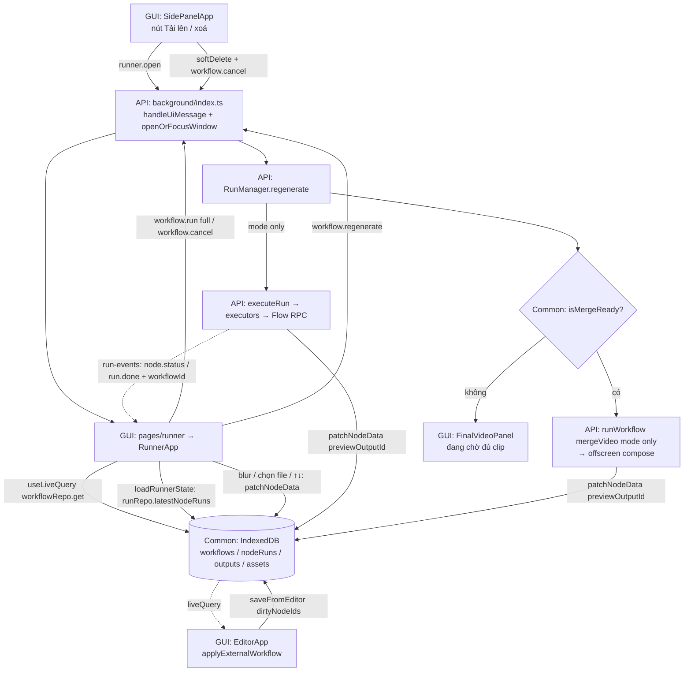

# Implementation Plan: Cửa sổ "Chạy" cho workflow (Workflow Input Window)

> **TL;DR**
> - **Goal**: Thêm cửa sổ "Chạy" (mở bằng nút "Tải lên" ở side panel) để user upload asset, sửa prompt/cấu hình, chạy, tạo lại từng cảnh, xem và tải video ghép mà không cần canvas.
> - **Scope**: Common + API (service worker) + GUI (pages/features)
> - **Phases**: 6, gồm Common 2, API 2, GUI 2; trình tự ở section 4
> - **Main risk**: Ba nơi cùng ghi một workflow (editor, cửa sổ "Chạy", SW); sai cách gộp là mất thay đổi của user.
> - **Done when**: Mọi AC trong `detail-spec.md` pass; `pnpm typecheck` và `pnpm test` xanh; kịch bản section 6 chạy đúng trên extension thật.

---

## 1. Context & Current State

- **Existing**:
  - Side panel chỉ có một hành động mở editor cho mỗi item (`src/features/sidepanel/SidePanelApp.tsx:43`).
  - Editor mở dạng popup 1280x800 và đưa cửa sổ cũ lên trước (`src/background/index.ts:231`), nhưng `editor.open` nằm ở listener riêng, chưa có trong union message.
  - Editor đọc workflow một lần, giữ trong `useEditorStore`, lưu cả document bằng `workflowRepo.save` (`src/features/editor/EditorApp.tsx:126`, `src/storage/repos/workflowRepo.ts:79`).
  - SW ghi node data (`ctx.patchNodeData`, `previewOutputId`, `formattedOutput`) bằng cách đọc rồi `save` cả workflow (`src/engine/RunManager.ts:406`, `src/engine/RunManager.ts:483`, `src/engine/RunManager.ts:507`).
  - `runRepo.listByWorkflow` gọi `limit` trước `sortBy('startedAt')`, nên không chắc lấy đúng các run mới nhất (`src/storage/repos/runRepo.ts:27`).
  - Run mode `only` đã có (`src/engine/RunManager.ts:173`); `runWorkflow` trả `runId` ngay sau khi xếp hàng (`src/engine/RunManager.ts:69`).
  - UI ghép video, sắp thứ tự, tải video nằm trong `MergeVideoBody` và gắn với `useEditorStore` (`src/features/editor/nodes/MergeVideoBody.tsx:41`).
- **Missing**:
  - Page và UI cửa sổ "Chạy"; message `runner.open`, `workflow.regenerate`.
  - Ghi theo node (patch) và đồng bộ editor với thay đổi bên ngoài.
  - Đọc trạng thái gần nhất của node từ `nodeRuns`.
  - Chặn chạy workflow đã xoá mềm: `workflowRepo.get` không lọc `deletedAt`, `cancelByWorkflow` không huỷ job còn trong hàng đợi (`src/engine/RunManager.ts:102`).
- **Constraints**:
  - Không đổi shape dữ liệu, không tăng `SCHEMA_VERSION` (đang là `5`, `src/shared/schema/index.ts:8`).
  - Message mới khai báo trong `src/shared/messaging/index.ts` trước (AGENTS.md quy tắc 4).
  - Chuỗi UI chỉ qua `src/shared/strings.ts`; không retry generate; asset Flow không upload lại.
  - `topoSort` ném lỗi khi có vòng (`src/engine/scheduler.ts:10`).
  - Page mới phải khai báo trong `build.rollupOptions.input` (`vite.config.ts:17`).
- **Pattern to follow**:
  - `src/pages/editor/main.tsx:1` - bootstrap page (log, `bootstrapStorage`, render).
  - `src/features/sidepanel/SidePanelApp.tsx:48` - đọc Dexie bằng `useLiveQuery`.
  - `tests/unit/run-only-node.test.ts:21` - test `RunManager` với router giả và bắt `run.done`.

## 2. Design Decisions

- **Chosen approach**:
  - Theo data contract đã chốt (D1 đến D7, A-01 đến A-05): patch theo node trong transaction Dexie; cửa sổ "Chạy" đọc bằng `useLiveQuery` + store Zustand nhỏ chỉ cho trạng thái chạy; SW điều phối "tạo lại rồi tự ghép"; editor gộp thay đổi bên ngoài theo node.
  - `RunManager.regenerate(workflowId, nodeId)` xếp một job duy nhất: chạy node (mode `only`), nhận `RunStatus` trả về từ `executeRun`, rồi nếu thành công và `isMergeReady` thì gọi `runWorkflow` cho node Merge (mode `only`).
  - Một helper `openOrFocusWindow(windows, workflowId, pagePath)` phục vụ cả editor và cửa sổ "Chạy".
- **Rejected**:
  - Kiểm tra `updatedAt` rồi ghi lại cả workflow - editor có thay đổi chưa lưu sẽ phải tự xử lý xung đột.
  - UI điều phối bước ghép sau `run.done` - đóng cửa sổ là mất bước ghép (AC-05.7).
  - Dùng lại `useEditorStore` hoặc nguyên `MergeVideoBody` cho cửa sổ "Chạy" - kéo theo view model React Flow, undo/redo, class canvas.
  - Lắng nghe `run.done` để nối bước ghép bằng callback toàn cục - thêm trạng thái chờ trong SW; job tuần tự trong `regenerate` đơn giản hơn.

### Refactor principles that shaped this design

- **KISS**: Selector là hàm thuần trên `Workflow`, không có lớp adapter; `regenerate` là một hàm async tuần tự thay vì cơ chế event/callback.
- **DRY**: `isMergeReady` (SW + UI) đặt ở `src/engine/mergeReady.ts`; `moveInOrder` ở `src/media/layout.ts` (MergeVideoBody + cửa sổ "Chạy"); `localAssetPatch` ở `src/shared/media.ts` (node Asset + ô upload); `ExportVideoButton` export từ `MediaPreview.tsx`; `openOrFocusWindow` dùng cho hai loại cửa sổ.
- **YAGNI**: Không thêm bảng/field, không nhớ kích thước cửa sổ, không có event SW mới cho "chờ đủ clip" (suy ra ở UI), không thêm tuỳ chọn cấu hình.
- **SOLID**: Repo chỉ lo ghi an toàn; `RunManager` chỉ lo chạy; `background/index.ts` chỉ định tuyến message; component cửa sổ "Chạy" chia theo vùng (toolbar, ô upload, danh sách cảnh, video cuối), không có component ôm cả màn hình.
- **Clean Code**: Tên theo ý định (`patchNodeData`, `saveFromEditor`, `latestNodeRuns`, `applyExternalWorkflow`); guard clause cho workflow không tồn tại/đã xoá/node sai loại; lỗi repo dùng mã hằng (`WORKFLOW_DELETED`, `WORKFLOW_NODE_NOT_FOUND`).
- **Performance**: `latestNodeRuns` đọc nodeRuns của 20 run bằng một truy vấn `where('runId').anyOf(...)` và gom một vòng vào `Map`; selector dựng `Map` id → node một lần rồi tra cứu; `useLiveQuery` chỉ đọc một workflow theo id.
- **Error handling**: Repo ném `Error` có mã, action UI bắt lỗi và hiện thông báo tiếng Việt, ô quay về giá trị trong workflow; message trả `MessageResponse` `ok: false`, UI không retry; selector bọc `topoSort` trong try/catch và trả trạng thái lỗi graph thay vì làm sập cửa sổ.

## 3. Flow Diagram

## 4. Work Matrix

| # | Item | Scope | Phase | Depends on | Detailed in |
|---|---|---|---|---|---|
| 1 | Type message mới (`runner.open`, `editor.open`, `workflow.regenerate`, `RunDoneEvent.workflowId`) | Common | Phase 1 | - | `2026-09-17-workflow-input-window-common.md` |
| 2 | `workflowRepo.patchNodeData` và `workflowRepo.saveFromEditor` | Common | Phase 1 | - | `2026-09-17-workflow-input-window-common.md` |
| 3 | `runRepo.latestNodeRuns` + sửa `listByWorkflow` lấy sai 20 run mới nhất | Common | Phase 1 | - | `2026-09-17-workflow-input-window-common.md` |
| 4 | Hàm thuần `mergeClipNodeIds` / `isMergeReady` | Common | Phase 1 | - | `2026-09-17-workflow-input-window-common.md` |
| 5 | SW ghi node data (`ctx.patchNodeData`, `previewOutputId`, `formattedOutput`) bằng `workflowRepo.patchNodeData` | API | Phase 1 | #2 | `2026-09-17-workflow-input-window-api.md` |
| 6 | Chặn chạy workflow đã xoá mềm (lúc xếp hàng và lúc bắt đầu chạy) | API | Phase 1 | - | `2026-09-17-workflow-input-window-api.md` |
| 7 | `run.done` mang `workflowId`; `executeRun` trả `RunStatus` | API | Phase 1 | #1 | `2026-09-17-workflow-input-window-api.md` |
| 8 | `RunManager.regenerate` (tạo lại + tự ghép) | API | Phase 2 | #4, #6, #7 | `2026-09-17-workflow-input-window-api.md` |
| 9 | Handler `workflow.regenerate`, `runner.open`, `editor.open` + `openOrFocusWindow` | API | Phase 2 | #1, #8 | `2026-09-17-workflow-input-window-api.md` |
| 10 | Tách dùng chung `moveInOrder`, `localAssetPatch`, `ExportVideoButton` (refactor MergeVideoBody, WorkflowNodeView) | GUI | Phase 1 | - | `2026-09-17-workflow-input-window-gui.md` |
| 11 | Page `runner` + input Vite | GUI | Phase 1 | - | `2026-09-17-workflow-input-window-gui.md` |
| 12 | Selector cửa sổ "Chạy" | GUI | Phase 1 | #4 | `2026-09-17-workflow-input-window-gui.md` |
| 13 | `useRunnerStore` + actions | GUI | Phase 1 | #1, #2, #3 | `2026-09-17-workflow-input-window-gui.md` |
| 14 | Component cửa sổ "Chạy" + chuỗi UI | GUI | Phase 1 | #9, #10, #11, #12, #13 | `2026-09-17-workflow-input-window-gui.md` |
| 15 | Editor: `dirtyNodeIds`, `applyExternalWorkflow`, lưu bằng `saveFromEditor`, khoá ghi ngay bằng `workflowRepo.setLocked` | GUI | Phase 2 | #2 | `2026-09-17-workflow-input-window-gui.md` |
| 16 | Side panel: nút "Tải lên", `editor.open` có type, xoá kèm `workflow.cancel` | GUI | Phase 2 | #9 | `2026-09-17-workflow-input-window-gui.md` |
| 17 | Cập nhật `docs/WORKFLOW.md` (SCHEMA_VERSION 5, cửa sổ "Chạy", `workflow.regenerate`, patch) | Common | Phase 2 | #5 đến #16 | `2026-09-17-workflow-input-window-common.md` |

Trình tự thi công: Common Phase 1 → API Phase 1 → API Phase 2 → GUI Phase 1 → GUI Phase 2 → Common Phase 2.
Cả ba scope đều có việc nên tạo đủ 3 sub-plan.

## 5. Out of Scope

- Thêm/xoá node, nối cạnh trong cửa sổ "Chạy" - đã chốt ở detail-spec, làm ở editor.
- Sửa/hiển thị cấu hình Merge (logo, audio, fps, bitrate), Auto Download, node note trong cửa sổ "Chạy" - detail-spec section 2.
- Đổi loại media của ô upload; nhớ kích thước/vị trí cửa sổ - detail-spec section 2.
- Tự tạo lại các cảnh phía sau khi tạo lại một cảnh - BR-09.
- Huỷ job còn trong hàng đợi toàn cục khi bấm Dừng (ngoài trường hợp workflow đã xoá) - hành vi `workflow.cancel` hiện có giữ nguyên.
- Sửa `AGENTS.md` - không đổi lệnh, path hay schema version nên không cần.
- Prototype UI (`/04-create-prototype-plan`) - user chuyển thẳng sang plan; giao diện theo dark theme + shadcn hiện có.

## 6. End-to-End Verification

- **Automated**: `pnpm typecheck` · `pnpm test` · `pnpm build`
- **Manual**:
  - `pnpm dev` → load unpacked `dist/` → mở side panel → item workflow có nút mở editor và "Tải lên".
  - Bấm "Tải lên" → cửa sổ "Chạy" 1280x800; bấm lần nữa → cửa sổ cũ được đưa lên trước.
  - Thay ảnh Character ở cột trái, sửa prompt một cảnh rồi rời ô → mở editor thấy giá trị mới.
  - Bấm Chạy toàn bộ → trạng thái/tiến độ từng cảnh cập nhật; video cuối hiện sau khi ghép; bấm Tải video → có file mp4.
  - Làm một cảnh lỗi (vd prompt vi phạm chính sách) → bấm Tạo lại sau khi sửa prompt → chỉ cảnh đó gọi Flow (xem Console), sau đó video cuối được ghép lại.
  - Đóng cửa sổ giữa lúc tạo lại → mở lại → thấy đúng trạng thái và kết quả.
  - Mở editor song song, sửa prompt node A ở editor (chưa lưu) và node B ở cửa sổ "Chạy" → lưu editor → cả hai thay đổi còn nguyên.
  - Khoá workflow ở editor → cửa sổ "Chạy" khoá mọi ô, vẫn Chạy/Dừng/Tạo lại được.
  - Xoá workflow ở side panel khi đang chạy → run dừng, cửa sổ hiện thông báo và khoá thao tác.
- **Edge cases**: workflow không có Merge (ẩn khung video cuối); chỉ có node tạo ảnh; không có Asset; node bị tắt không hiện; asset Flow nối vào Merge (lỗi `FLOW_ASSET_NO_UPLOAD`); tắt SW (chrome://serviceworker-internals) giữa lúc chạy rồi quay lại cửa sổ.

## 7. References

- Ticket: N/A
- Research/spec:
  - `docs/specs/raw-spec-workflow-input-window.md`
  - `docs/specs/workflow-input-window/detail-spec.md`
  - `docs/specs/workflow-input-window/data-contract-workflow-input-window.md`
  - `docs/WORKFLOW.md`
- Refactor skill: `.claude/skills/refactor/SKILL.md`
- Sub-plans: `2026-09-17-workflow-input-window-common.md` · `2026-09-17-workflow-input-window-api.md` · `2026-09-17-workflow-input-window-gui.md`
